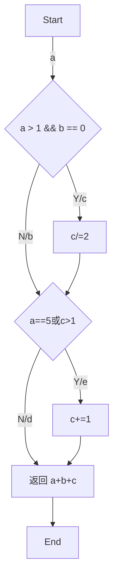

### 数据库设计的基本步骤

1. 需求分析
2. 概念结构设计 ER 图或者是设计数据字典
3. 逻辑结构设计把 ER 图转为逻辑模型
4. 物理结构设计把逻辑模型转为物理模型
5. 数据库实施写 SQL 代码
6. 数据库运行维护性能检测

### E-R 图

如：

- **实体**是长方形体现,
- **属性**则是椭圆形,
- **关系**为菱形

1 对 1 (1:1) ：`1 对 1` 关系是指对于实体集 `A` 与实体集 `B`，`A` 中的每一个实体至多与 `B` 中一个实体有关系；反之，在实体集 `B` 中的每个实体至多与实体集 `A` 中一个实体有关系。
1 对多 (1:N) ：`1 对多`关系是指实体集 `A` 与实体集 `B` 中至少有 `N` (N>0) 个实体有关系；并且实体集 B 中每一个实体至多与实体集 `A` 中一个实体有关系。
多对多 (M:N) ：`多对多` 关系是指实体集 `A` 中的每一个实体与实体集 `B` 中至少有 M (M>0) 个实体有关系，并且实体集 `B` 中的每一个实体与实体集 `A` 中的至少 `N` (N>0）个实体有关系。

当局部 E-R 图合并成全局 E-R 图时可能出现 `3` 种冲突，包括属性冲突，结构冲突，命名冲突。

