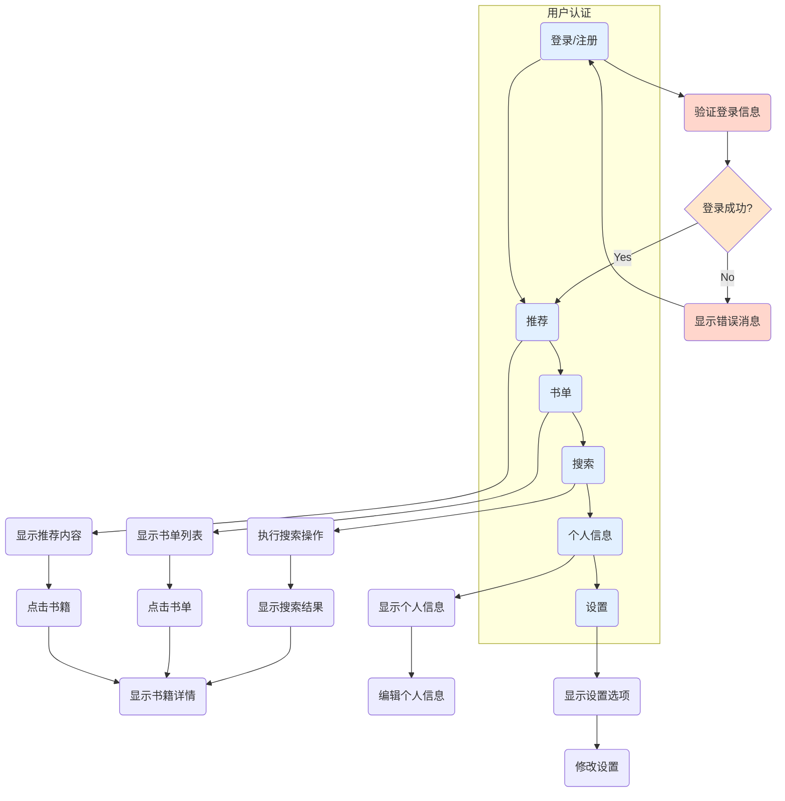

## 一、实验目的

1. 熟悉Android程序设计的基本概念；

2. 了解Android程序框架结构、界面设计和界面编程；

3. 熟练掌握常用界面控件、菜单以及界面事件的响应处理。

## 二、实验内容要求

1. 掌握TextView、EditText、Button、CheckBox、ListView等基本UI组件的使用，并运用、融合到一个整体项目中；

2. 掌握五种布局管理器的使用方法与合理配合，并完善、优化项目中布局；掌握各种列表的使用方法及适配器的高效配合；理解提示信息的使用方法；

3. 分别实现各个UI控件的事件处理及监听机制，形成完整功能链。

## 三、设计流程以及功能实现

### 1.设计流程图：

基于上面的流程图，需要的功能大致如下：

1. 用户认证：提供登录和注册功能，用户可以使用已有账户登录或创建新账户。
2. 推荐：根据用户的偏好和阅读历史，向用户推荐适合的图书内容。
3. 书单：用户可以创建和管理自己的书单，将感兴趣的图书添加到书单中，或从书单中移除图书。
4. 搜索：提供图书搜索功能，用户可以根据关键词或其他条件搜索图书。
5. 个人信息页面：显示用户的个人信息，包括用户名、头像、个人简介等。
6. 设置页面：允许用户修改个人设置，例如密码、通知偏好等。
7. 显示推荐内容：根据用户的兴趣和阅读历史，向用户展示推荐的图书内容。
8. 书籍详情：用户可以点击图书，查看详细信息和评论。
9. 编辑个人信息：允许用户编辑和更新个人信息。
10. 修改设置：允许用户更改个人偏好设置和应用程序设置。
### 2.初步界面设计
1. 登录与注册


2. 菜单
 
 


3. 搜索和个人信息

   


### 2.UI实现

#### (1)登录与注册
- 主要布局文件
```xml
<?xml version="1.0" encoding="utf-8"?>  
<androidx.coordinatorlayout.widget.CoordinatorLayout  
xmlns:android="http://schemas.android.com/apk/res/android"  
xmlns:app="http://schemas.android.com/apk/res-auto"  
xmlns:tools="http://schemas.android.com/tools"  
android:layout_width="match_parent"  
android:layout_height="match_parent"  
tools:context=".ui.auth.AuthActivity"  
android:transitionName="transition_login"  
>  
<LinearLayout  
android:layout_width="match_parent"  
android:layout_height="match_parent"  
android:background="@color/white"  
android:padding="30dp"  
android:orientation="vertical">  
  
  
<TextView  
android:id="@+id/auth_title"  
android:layout_width="wrap_content"  
android:layout_height="wrap_content"  
android:layout_marginTop="50dp"  
android:text="@string/login"  
android:textAllCaps="true"  
android:textColor="@color/black"  
android:textSize="40sp" />  
<ProgressBar  
android:id="@+id/loading"  
android:indeterminateTint="@color/indigo"  
android:layout_width="wrap_content"  
android:layout_height="wrap_content"  
android:layout_gravity="center"  
android:layout_marginTop="64dp"  
android:layout_marginBottom="64dp"  
android:visibility="gone"  
app:layout_constraintBottom_toBottomOf="parent"  
app:layout_constraintEnd_toEndOf="@+id/password"  
app:layout_constraintStart_toStartOf="@+id/password"  
app:layout_constraintTop_toTopOf="parent"  
app:layout_constraintVertical_bias="0.3"  
tools:ignore="NotSibling" />  
<include layout="@layout/content_auth"/>  
  
</LinearLayout>  
</androidx.coordinatorlayout.widget.CoordinatorLayout>
```
- api接口
```kotlin
interface ApiService {  
@FormUrlEncoded  
@POST("/api/auth/login")  
fun login(  
@Field("username") username: String,  
@Field("password") password: String,  
@Field("remember") remember: Boolean  
): Call<ApiResponse<String>>  
  
@FormUrlEncoded  
@POST("/api/auth/valid-register-email")  
fun validateRegisterEmail(  
@Field("email") email: String  
): Call<ApiResponse<String>>  
  
@FormUrlEncoded  
@POST("/api/auth/valid-reset-email")  
fun validateResetEmail(  
@Field("email") email: String  
): Call<ApiResponse<String>>  
  
@FormUrlEncoded  
@POST("/api/auth/register")  
fun registerUser(  
@Field("username") username: String,  
@Field("password") password: String,  
@Field("email") email: String,  
@Field("code") code: String  
): Call<ApiResponse<String>>  
  
@FormUrlEncoded  
@POST("/api/auth/start-reset")  
fun startReset(  
@Field("email") email: String,  
@Field("code") code: String  
): Call<ApiResponse<String>>  
  
@FormUrlEncoded  
@POST("/api/auth/do-reset")  
fun resetPassword(  
@Field("password") password: String  
): Call<ApiResponse<String>>  
  
}
```


#### (2)App首页及个人主页
- 主要布局文件
```xml
<?xml version="1.0" encoding="utf-8"?>  
<androidx.drawerlayout.widget.DrawerLayout  
xmlns:android="http://schemas.android.com/apk/res/android"  
xmlns:app="http://schemas.android.com/apk/res-auto"  
xmlns:tools="http://schemas.android.com/tools"  
android:id="@+id/drawer_layout"  
android:layout_width="match_parent"  
android:layout_height="match_parent"  
android:fitsSystemWindows="true"  
tools:openDrawer="start">  
  
<include  
android:id="@+id/app_bar_main"  
layout="@layout/app_bar_main"  
android:layout_width="match_parent"  
android:layout_height="match_parent" />  
  
<com.google.android.material.navigation.NavigationView  
android:id="@+id/nav_view"  
android:layout_width="wrap_content"  
android:layout_height="match_parent"  
android:layout_gravity="start"  
android:fitsSystemWindows="true"  
app:headerLayout="@layout/nav_header_main"  
app:menu="@menu/activity_main_drawer" />  
</androidx.drawerlayout.widget.DrawerLayout>
```
```xml
<?xml version="1.0" encoding="utf-8"?>  
<androidx.coordinatorlayout.widget.CoordinatorLayout  
xmlns:android="http://schemas.android.com/apk/res/android"  
xmlns:app="http://schemas.android.com/apk/res-auto"  
xmlns:tools="http://schemas.android.com/tools"  
android:layout_width="match_parent"  
android:layout_height="match_parent"  
tools:context=".MainActivity">  
  
<com.google.android.material.appbar.AppBarLayout  
android:layout_height="wrap_content"  
android:layout_width="match_parent"  
android:theme="@style/Theme.Mlib.AppBarOverlay">  
  
<com.google.android.material.appbar.MaterialToolbar  
android:id="@+id/toolbar"  
android:layout_width="match_parent"  
android:layout_height="?attr/actionBarSize"  
app:title="@string/page_title"  
app:menu="@menu/main"  
app:navigationIcon="@drawable/ic_menu"  
style="@style/Widget.MaterialComponents.Toolbar.Primary"  
/>  
  
</com.google.android.material.appbar.AppBarLayout>  
  
<include layout="@layout/content_main"/>  
  
</androidx.coordinatorlayout.widget.CoordinatorLayout>
```


#### (3)书单和设置


## 四、总结

我在本次实验中达到了实验的目标和要求，经历了一系列的设计过程和问题解决。实验的目的是熟悉Android程序设计的基本概念，了解Android程序框架结构、界面设计和界面编程，并熟练掌握常用界面控件、布局管理器和事件处理。

在整个实验过程中，我遇到了许多问题，比如如何使用不同的UI组件、布局管理器和适配器，以及如何处理界面事件和监听机制。但是我并不气馁，我积极采取了解决问题的方法。我向老师请教，查阅了参考书，询问了同学，还上网搜索了一些博客和教程。通过这些努力，我一一解决了遇到的问题，并不断提升了自己的问题分析和解决能力。

通过实验，我不仅掌握了TextView、EditText、Button、CheckBox、ListView等基本UI组件的使用方法，还学会了合理使用不同的布局管理器和优化布局。我理解了列表的使用方法以及适配器的重要性。同时，我也学会了处理各种UI控件的事件和监听机制，让它们能够相互配合形成完整的功能链。

在整个实验过程中，我意识到自己对所学知识的理解还有待提高，还有很多方面的知识需要学习和掌握。但是我相信，通过不断的学习和实践，我将能够进一步提升自己在Android开发领域的能力。