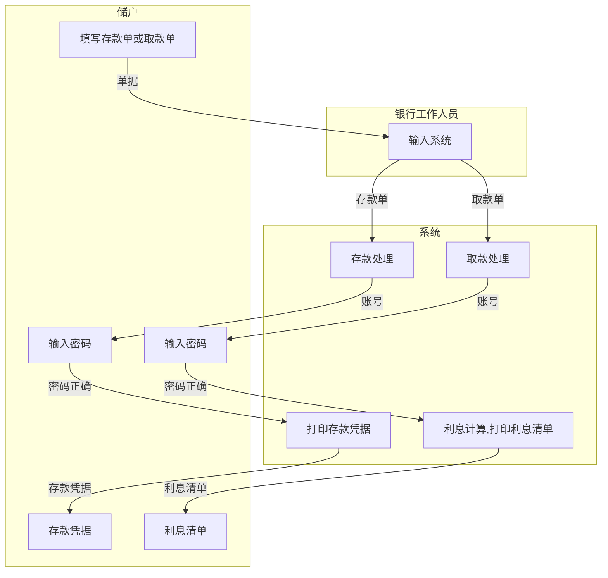
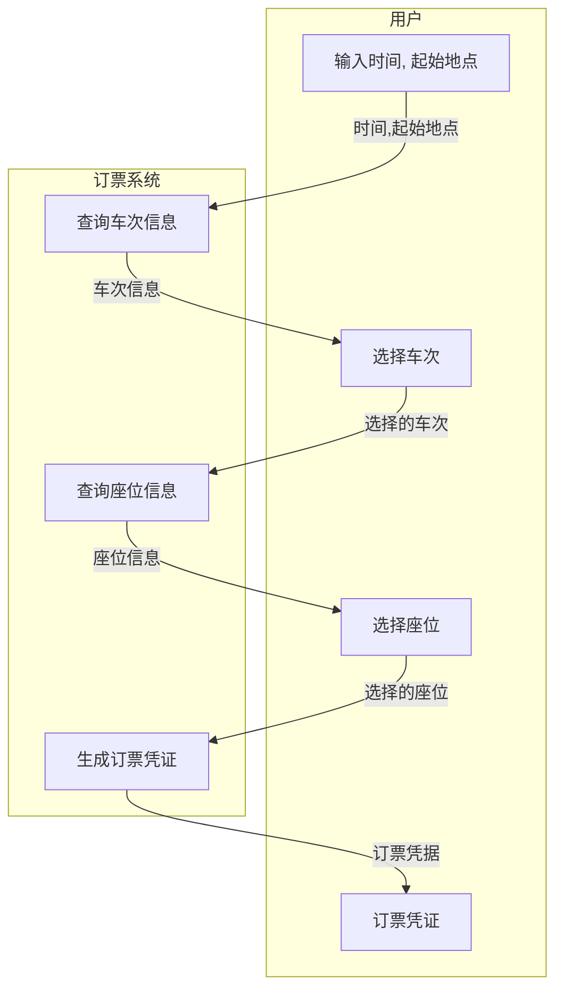
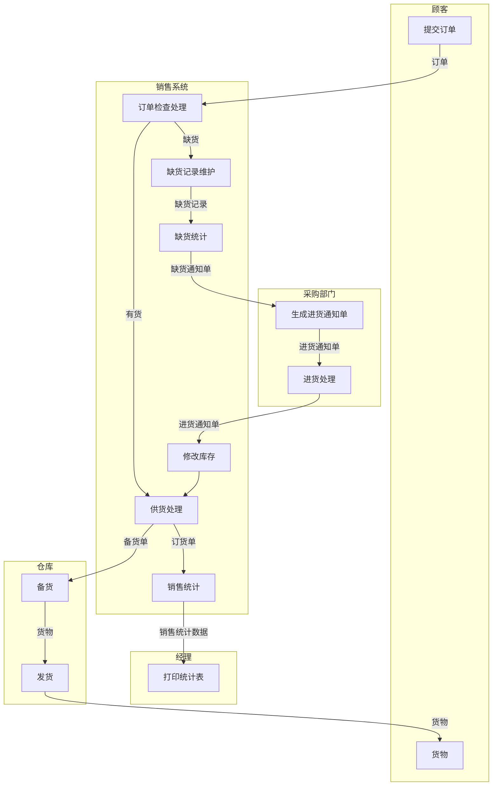
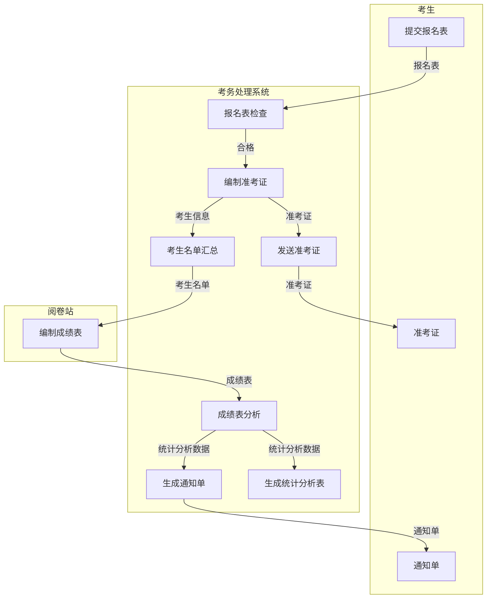

## 1、判断题

(1) 需求分析的主要目的是制定软件开发的具体方案。 (X) 

(2) 用户对软件需求的描述不精确，往往是产生软件危机的原因之一。 (✓) 

(3) 分层的DFD图可以用于可行性分析阶段，描述系统的物理结构。 (X) 

(4) 在用户需求分析时观察用户手工操作过程不是为了模拟手工操作过程，而是为了获取第一手资料，并从中提取出有价值的需求。 (✓) 

(5) 需求规格说明书描述了系统每个功能的实现。 (X)

## 2.选择题

(1)需求工程的主要目的是(C)。

A.制定系统开发的具体方案 B.进一步确定系统的需求
C.解决系统是“做什么的问题” D.解决系统是“如何做的问题”

(2)需求分析的任务不包括(B)。

A.问题分析 B.系统设计 C.需求描述 D.需求评审

(3)软件分析的第一步要做的工作是(A)。

A.定义系统的目标 B.定义系统的功能模块
C.分析用户需求 D.分析系统开发的可行性

(4)可行性研究的目的是用最小的代价在尽可能短的时间内确定问题的(A)。

A.能否可解 B.工程进度 C.开发计划 D.人员配置

(5)需求分析最终结果是产生(B)。

A.项目开发计划 B.需求规格说明书
C.设计说明书 D.可行性分析报告

(6)在结构化分析方法中，(C)是表达系统内部数据运动的图形化技术。

A.数据字典 B.实体关系图 C.数据流图 D.状态转换图

(7)DFD中的每个加工至少需要(D)。

A.一个输入流 B.一个输出流
C.一个输入或输出流 D.一个输入流和一个输出流

(8)需求分析的主要方法有(C)。

A.形式化分析方法 B. PAD图描述
C.结构化分析方法 D.程序流程图

(9)SA法的主要描述手段有(B)。

A.系统流程图和模块图 B. DFD图、数据字典、加工说明
C.软件结构图、加工说明 D.功能结构图、加工说明

(10)软件需求分析阶段的工作，可以分为以下4个方面：对问题的识别、分析与综合、编写需求分析文档以及(C)。

A.总结 B.编写阶段性报告
C.进行需求分析评审 D.以上答案都不正确

## 3.简答题
### (1)什么是需求分析?需求分析的任务是什么?
需求分析是软件工程中的一个阶段，旨在识别和明确系统或软件应该具备的功能、性能和约束条件。需求分析的任务包括以下几个方面：

-   收集和识别用户需求：与用户进行沟通和访谈，了解他们的需求和期望。
-   分析和整理需求：对用户提出的需求进行分析、分类和整理，确保需求的一致性和完整性。
-   规格化需求：将需求转化为明确、可衡量和可验证的规格说明，以便软件开发团队理解和实现

### (3)需求工程包含哪些内容?如何写好需求规格说明?

需求工程包含以下内容：

-   需求获取：通过与用户、利益相关者和其他相关方沟通和交流，获取系统需求的过程。
-   需求分析：对收集到的需求进行分析、整理和澄清，以确保需求的正确性、一致性和可行性。
-   需求规格说明：将需求规范化和详细描述，以便开发团队理解和实现。
-   需求验证和确认：验证需求是否满足用户的期望，并与用户进行确认。
-   需求管理：跟踪和管理需求的变化、优先级和版本控制。

要编写好需求规格说明，可以考虑以下几点：

-   明确和精确地描述每个需求：使用清晰的语言，确保每个需求都能被准确理解。
-   尽可能具体和可衡量的规格：使用度量标准或指标来定义需求的性能和功能要求，使其可被验证。
-   分清主要需求和次要需求：将关键和基本需求与次要的或可选的需求进行区分，以便开发团队能够有针对性地实现。
-   使用图形化工具辅助说明：使用UML图、流程图或数据流图等图形化工具来辅助说明需求，增加可理解性和可视化效果。
-   可追踪性：为每个需求提供唯一的标识符，并建立需求之间的关联，以便在后续开发和测试中进行跟踪和验证。

### (7)什么是结构化分析方法?结构化分析方法的结果是什么?

结构化分析方法是一种软件工程中的分析技术，旨在通过定义系统的功能、数据和行为，来分析和描述系统的内部结构和流程。结构化分析方法的结果包括以下几个方面：

-   数据流图（DFD）：用于描述系统内部的数据流动和处理过程，以及数据的来源和去向。
-   数据字典：用于定义系统中使用的各种数据元素、数据结构和数据

## 4.应用题
### (1)某银行储蓄系统的工作过程大致如下。
1. 由储户填写存款单或取款单，然后交由银行工作人员输入系统。
2. 如果是存款，系统将记录存款账号、存款人姓名、身份证号码、存款类型、存款日期、到期日期、利率等信息，并会提示储户键入密码。在此之后，系统会打印一张存款凭据给储户。
3. 如果是取款，则系统首先会根据存款账号核对储户密码。若密码正确，则系统会计算利息，并打印出利息清单给储户。
请使用数据流图分层描述该系统的逻辑加工流程。

### (2)请用结构化分析方法进行火车票订票系统的需求工程，给出数据流图、数据字典描述。

数据流：
- 输入时间、起始地点：用户输入的出发时间和起始地点信息
- 查询车次信息：系统根据输入的时间和起始地点查询的车次信息
- 选择车次：用户从车次列表中选择的车次信息
- 查询座位信息：系统根据选择的车次查询的座位信息
- 选择座位：用户从座位列表中选择的座位信息
- 生成订票凭证：系统根据用户选择的车次和座位信息生成的订票凭证信息

数据存储：
- 车次信息：包含火车车次的相关信息，xx号列车，各站到站时间等
- 座位信息：包含座位的相关信息，座位号xx车厢xx座位

处理：
- 订票系统：负责处理用户输入的时间和起始地点信息，并进行相关的查询、选择和生成订票凭证的操作

### (3)某企业的销售管理系统的功能如下。
1. 接受顾客的订单，检查订单，若库存有货，进行供货处理，即修改库存，给仓库开备货单，并且将订货单留底；若库存量不足，将缺货订单登入缺货记录。
2. 根据缺货记录进行缺货统计，将缺货通知单发给采购部门，以便采购。
3. 根据采购部门发来的进货通知单处理进货，即修改库存，并从缺货记录中取出缺货订单进行供货处理。
4. 根据留底的订单进行销售统计，打印统计表给经理。
运用结构化分析方法进行功能分析，画出系统的分层数据流图，写出主要的数据条目和加工说明。

顾客模块：

-   数据条目：订单
-   加工说明：（A）：顾客提交订单给销售系统进行处理。

销售系统模块：

-   数据条目：订单、供货处理结果、留底订单、缺货记录、缺货通知单、
-   加工说明：
    -   订单检查处理（B）：接受顾客的订单并进行检查，如果库存有货，进行供货处理；如果库存不足，将订单记录到缺货记录中。
    -   供货处理（C）：根据库存情况进行供货处理，包括修改库存、开备货单。
    -   缺货记录维护（D）：记录缺货订单，并根据缺货订单进行缺货统计。
    -   销售统计（E）：根据留底的订单进行销售统计，生成销售统计数据。
    -   缺货统计（F）：根据缺货记录进行缺货统计。
    -   生成缺货通知单（G）：将缺货通知单发送给采购部门，以便采购补货。

采购部门模块：

-   数据条目：进货通知单
-   加工说明：
   
    -   进货处理（H）：根据采购部门发来的进货通知单进行进货处理，包括修改库存和从缺货记录中取出缺货订单进行供货处理。

经理模块：

-   数据条目：销售统计数据
-   加工说明：（I）：经理根据销售统计数据打印统计表

### (4)一个考务处理系统的功能要求如下。
1. 对考生送来的报名表进行检查。
2. 对合格的报名表编好准考证号码后将准考证送给考生，并将汇总后的考生名单送给阅卷站。
3. 对阅卷站送来的成绩表进行检查，并根据考试中心指定的合格标准审定合格者。
4. 填写考生通知单(内容包含考试成绩及合格/不合格标志)，送给考生。
5. 按地区、年龄、文化程度、职业、考试级别等进行成绩分类统计及试题难度分析，产生统计分析表。
运用结构化分析方法进行功能分析，画出系统的分层数据流图。

在数据流图中，主要的数据流和加工说明如下：

考生模块：

-   数据条目：报名表、准考证、通知单
-   加工说明：
    -   提交报名表（A）：考生将报名表提交给考务处理系统。

考务处理系统模块：

-   数据条目：报名表、准考证、考生名单、成绩表、合格者、通知单、统计分析数据
-   加工说明：
    -   报名表检查（B）：对考生送来的报名表进行检查，判断是否合格。
    -   编制准考证（C）：对合格的报名表编制准考证号码。
    -   发送准考证（D）：将编制好的准考证送给考生。
    -   考生名单汇总（E）：汇总合格的考生名单并发送给阅卷站。
    -   成绩表分析（F）：对阅卷站送来的成绩表进行分析，比如说判断是否合格。
    -   生成通知单（G）：根据考试成绩及合格/不合格标志生成考生通知单。
    -   生成统计分析表（H）：根据地区、年龄、文化程度、职业、考试级别等进行成绩分类统计及试题

阅卷站：

- 数据条目：考生名单，成绩表
- 加工说明
	- 编制成绩表（I）：根据阅卷结果和考生名单编制成绩表