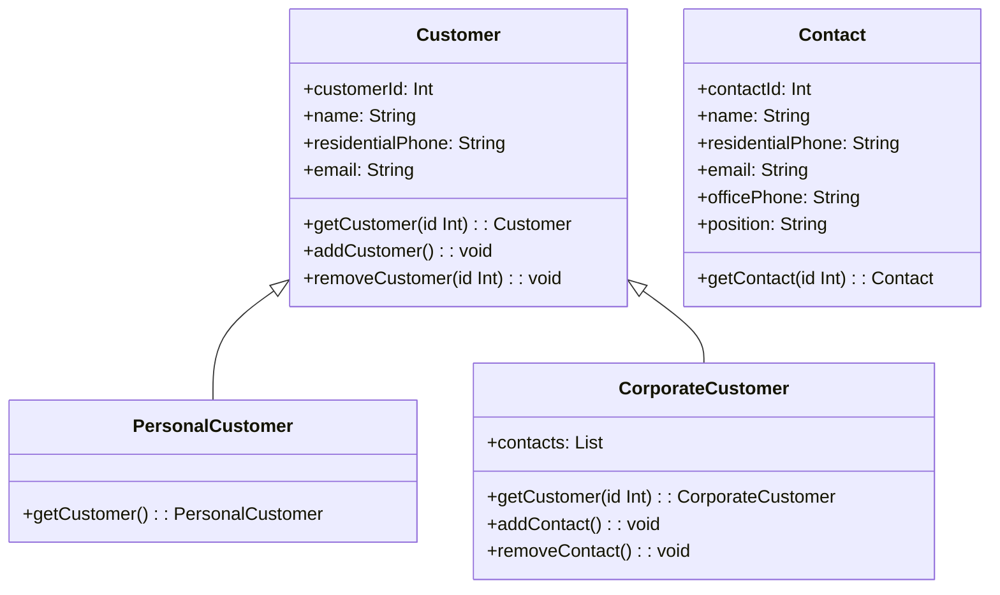

## 1.判断题

(1)边界对象表示了系统与参与者之间的接口。在每一个用例中，该对象从参与者处收集信息，并将之转换为一种被实体对象和控制对象使用的形式。 (√)

(2)采用面向对象的方法开发软件的过程中，抽取和整理用户需求并建立问题域精确模型的过程叫面向对象分析。 (√)

(3)继承仅仅允许单重继承，即不允许一个子类有多个父类。 (×)

## 2.选择题

(1)采用UML进行软件建模的过程中，类图是系统的一种静态视图，用(B)可明确表示两类事物之间存在的整体/部分形式的关联关系。
A.依赖关系 B.聚合关系 C.泛化关系 D.实现关系

(2)在UML语言中,图5.41中的a、b、c三种图形符号按照顺序分别表示(C)。

A.边界对象、实体对象、控制对象 B.实体对象、边界对象、控制对象
C.控制对象、实体对象、边界对象 D.边界对象、控制对象、实体对象

(3)不同的对象收到同一消息可以产生完全不同的结果，这一现象叫做(B)。
A.继承 B.多态 C.动态绑定 D.静态绑定

## 3.简答题
(1)简述对象与类之间的联系与区别。

> 对象是类的实例化，它是具体的、实际存在的事物，具有状态和行为。对象是类的具体表现，可以通过类来创建多个对象。
> 类是一种抽象的概念，它是一组具有相同属性和行为的对象的模板或蓝图。类定义了对象的共同特征和行为，并提供了创建对象的方法和属性。类可以看作是对象的抽象，描述了对象的共同属性和行为。

联系：
- 类是对象的抽象，而对象是类的具体实例。一个类可以创建多个对象，这些对象共享类所定义的属性和行为。

区别：

- 类是抽象的，描述了一类对象的共同特征和行为，而对象是具体的、实际存在的实例。
- 类定义了对象所具有的属性和方法，而对象是类的具体表现，具有具体的属性值和方法的执行结果。
- 类是静态的，定义了对象的结构和行为，而对象是动态的，可以在运行时改变自己的状态和执行方法。

(2)试描述继承性与多态性的作用。 
- 继承性（Inheritance）是面向对象编程中的一个重要概念，它允许一个类（子类）继承另一个类（父类）的属性和方法。继承性的作用是实现代码的重用和扩展。子类可以继承父类的属性和方法，并且可以在其基础上添加新的属性和方法，或者对继承的属性和方法进行修改和重写。通过继承，可以建立类之间的层次结构，提高代码的可维护性和可扩展性。
    
- 多态性（Polymorphism）是面向对象编程的另一个重要概念，它允许不同的对象对同一消息作出不同的响应。多态性的作用是增加代码的灵活性和可复用性。通过多态性，可以使用父类类型的变量来引用子类的对象，并根据实际的对象类型调用相应的方法。这样可以编写通用的代码，提高代码的可扩展性和可维护性。多态性还可以实现接口的统一，通过接口的多态性可以编写灵活的、可替换的代码，便于代码的扩展和重用。

(3)通过看图回答下面的问题。 
在图5.42所示的用例图(UseCase Diagram)中: 

1. X1、X2和X3表示用例中的什么? 
   用例图中的角色
2. 已知UC3是抽象用例，那么X1可通过图中的哪些用例与系统进行交互?
   X1可通过图中的UC4 UC1用例与系统进行交互
3. 图中哪个用例是UC4的可选部分，哪个用例是UC4的必须部分?
   UC5是UC4的必须部分，UC2是可选部分

4.应用题
(1)某客户信息管理系统中保存着两类客户的信息：个人客户和集团客户。
个人客户：对于这类客户，系统保存了其客户标识(由系统生成)和基本信息(包括姓名、住宅电话和E-mail )。
集团客户：集团客户可以创建和管理自己的若干名联系人。对于这类客户，系统除了保存其客户标识(由系统生成)之外，也保存了其联系人的信息。联系人的信息包括姓名、住宅电话、E-mail、办公电话以及职位。
- 该系统除了可以保存客户信息之外，还具有以下功能。
- 向系统中添加客户(addCustomer)。
- 根据给定的客户标识，在系统中查找该客户(getCustomer)。
- 根据给定的客户标识,从系统中删除该客户(removeCustomer)。
- 创建新的联系人(addContact)。
- 在系统中查找指定的联系人(getContact)。
- 从系统中删除指定的联系人(removeContact)。
该系统采用面向对象方法进行开发。在面向对象分析阶段，根据上述描述，得到该系统中的类，并绘制UML的类图。

`Customer` 类是顶层的抽象类，包含了通用的客户信息属性和方法，包括客户标识、姓名、住宅电话、E-mail，以及获取、添加和删除客户的方法。`PersonalCustomer` 类继承自 `Customer` 类，表示个人客户，并具有获取个人客户的方法。`CorporateCustomer` 类也继承自 `Customer` 类，表示集团客户，并包含了一个联系人列表，以及添加和删除联系人的方法。`Contact` 类表示联系人，包括姓名、住宅电话、E-mail、办公电话和职位信息，以及获取联系人的方法。