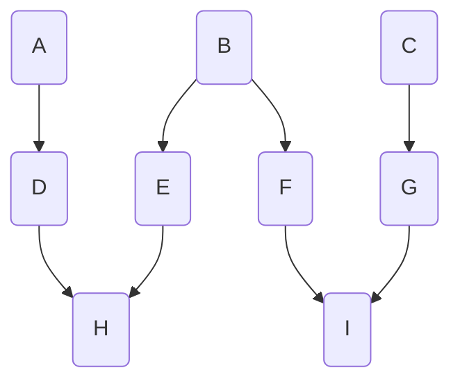

## 1.判断题
(1)软件项目的估算结果是比较准确的。 (✖️)

(2)进度和成本是关系最为密切的两个目的，几乎成了对立关系，进度的缩短一定依靠增加成本实现，而成本的降低也一定是以牺牲工期进度为代价的。 (✖️)

(3)当减少项目资源的时候，项目的完成时间不一定会发生变化。 (✔)

(4)PDM网络图只适合表示完成-开始的逻辑关系。 (✖️)

(5)项目早期和信息不足的时候，可以采用自下而上的估算方法进行成本估算。(✖️)

(6)活动的最早开始时间和最早结束时间可以通过正向计算得到。 (✔)

(7)若实际成本累计小于分摊预算累计，而且盈余累计大于成本累计，说明成本计划和进度计划没有得到较好的控制。 (✖️)

(8)项目经理是一个综合的角色。 (✔)

(9)项目团队成员在初期就确定了，不会随着项目的进展和任务的展开而不断地增加。(✖️)

(10)如果风险缓解工作失败，风险已成为现实，就要启动应急计划。 (✔)

## 2.选择题

(1)关于网络图，下面(C)是不正确的。

A.网络图可用于安排计划 B.网络图展示任务之间的逻辑关系
C.网络图可用于跟踪项目 D.网络图可用于详细的时间管理

(2)如果你是某项目的项目经理，你已经估算出每个单元的成本是¥129，这个项目一共有1200个单元，你会采用(D) 。

A.自下而上估算法 B.类比估算法
C.专家估算法 D.参数估算法

(3)赶工一个任务时，你应该关注(C)

A.尽可能多的任务 B.非关键任务
C.加速执行关键路径上的任务 D.通过成本最低化加速执行任务

(4)如果你已经决定对每个活动估计用一个时间估计值的方法来进行估计，那么你将采用(C)方法。

A. PERT B. PDM
C. CPM D. WBS

(5)风险的3个属性是(B) 。

A.风险发生的时间地点、负责人 B.风险事件、概率、影响
C.风险事件、时间、影响 D.风险数量、风险影响程度、概率

(6)为了有效地管理项目，应该将工作分解为更小的部分，以下各项中(C)不能说明任务应该分解到什么程度。

A.可以在80小时内完成 B.不能再进一步进行逻辑细分了
C.可由一个人完成 D.可以进行实际估算

(7)如果一个项目的估算成本是1500元，并且计划今天应该完成这个项目，然而到今天为止实际只完成了其中的2/3，实际花销1350元，则成本偏差(CV)是(C)

A.150元 B.-150元
C.-350元 D.-500元

(8)如果在一个项目网络图中，任务A有15天的自由浮动和25天的总浮动，但是任务A的最早开始时间延误了30天，那么这对项目意味着( A ) 。

A.任务A的下一个任务的最早开始时间将延迟15天
B.任务A的工期将缩短15天
C.项目的完成时间延长25天
D.对项目没有影响

(9)进度控制的一个重要组成部分是(A)

A.确定进度偏差是否需要采取纠正措施
B.定义为项目的可变付成果所需要的活动
C.评估WBS定义是否足以支持进度计划
D.确保项目队伍的士气高昂，发挥团队成员的潜力

(10)活动A 历时为3天，开始于星期一(4号)，后置活动B与活动A 具有完成一开始的依赖关系。完成一开始关系有3天的滞后，而且活动B历时为4天，星期天为非工作日，从这些数据可以得出(D)

A.网项活动的总历时为8天
B.活动B 完成是星期三，14号
C.活动A 开始到活动B 完成之间的日历时间( calendar time )是14天
D.活动A 开始到活动B完成之间的日历时间是11天

## 3.应用题

**假设你作为一个负责人，从现在开始组织筹备一次义演，时间为三个星期之后，你所领导的小组成员除进行演出的准备工作外，还需自行编排节目，并外请若干演员参与演出，请利用甘特图方法对此过程作一计划。**

方案说明： 

	1. 选定剧本：组织讨论，收集剧本，最后确定剧本，确定导演、编剧及设备。（第１天）
	2. 确定角色：确定节目内容并分配角色和联系、确定友情出演的演员。（第2-3天） 
	3. 宣传准备：海报、颜料、横幅等宣传物品准备。（第4-6天） 
	4. 节目排练：选定节目排练时间，排练节目（第3-20天） 
	5. 宣传义演：展开海报宣传、看板宣传及条幅宣传。（第6-10天） 
	6. 会场确定：将会场的地点确定。（第11-12天） 
	7. 设备及演出用品准备。（第12-16天） 
	8. 义演彩排。（第18-20天） 
	9. 最后检查：出演前的全部总检查，及人员的休息。（第21天）

```mermaid
gantt
    title 慈善义演计划甘特图
    dateFormat  DD
    section 策划
    选定剧本           :done, 01, 1d
    确定角色           :done, 02, 2d
    宣传准备           :done, 04, 3d
    section 排练
    节目排练           :done, 03, 18d
    section 宣传
    宣传义演           :done, 06, 5d
    section 确定会场
    会场确定           :done, 11, 2d
    section 准备
    设备及演出用品准备 :done, 12, 5d
    section 彩排
    义演彩排           :done, 18, 3d
    section 最后检查
    最后检查           :done, 21, 1d
```

**试对下图所示某软件系统建设案例展开分析：**

1. 试用项目计划与评审技术（PERT）画出其对应的网络计划图。
2. 找出其关键路径。
3. 计算该软件系统建设的最小工期

|活动|紧前活动|活动时间（周）|
|---|---|---|
|A|无|3|
|B|无|2|
|C|无|4|
|D|A|7|
|E|B|2|
|F|B|6|
|G|C|8|
|H|D、E|8|
|I|F、G|7|

1. 项目计划与评审技术（PERT）画出的网络计划图如下：

- 关键路径图

2. 关键路径为 C->G->I。
3. 最小工期为关键路径上所有活动时间之和，
   C->G->I: 4 + 8 + 7 = 19
   最小工期为19周

