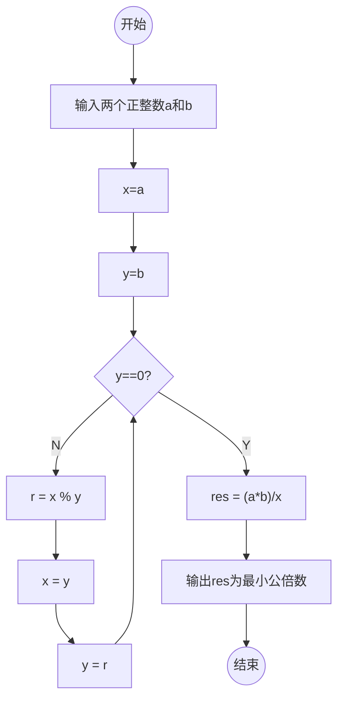
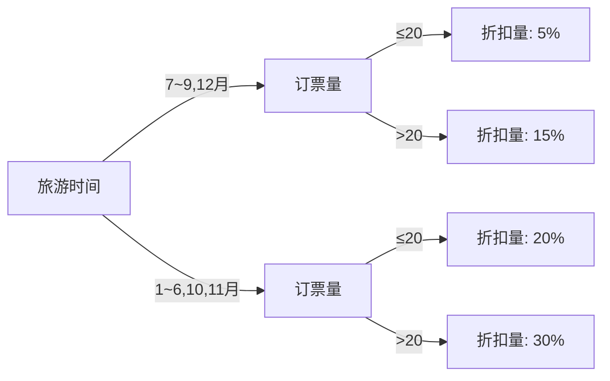

## 1.判断题
(1)在同一用户界面中，所有的菜单选择、命令输入、数据显示和其他功能应采用不同的形式和风格。(错误)

(2)最高的耦合度是数据耦合。 (错误)

(3)编程中应采用统一的标准和约定，降低程序的复杂性。 (正确)

(4)流程图也称为框图程序，是程序最常用的一种表示法。 (正确)

(5)理想的人机界面应针对具有典型个性的特定的一类用户设计。 (错误)

(6)重视程序结构的设计，能使程序具有较好的层次结构。 (正确)

(7)软件过程设计不用遵循“自上而下，逐步求精”的原则和单入口单出口的结构化设计思想。 (错误)

(8)软件开发、设计几乎都是从头开始，成本和进度很难估计。 (正确)

(9)耦合度是对软件结构中模块间关联程度的一种度量。在设计软件时应追求耦合尽可能紧密的的系统。 (错误) 

(10)SD法是一种面向数据结构的设计方法，强调程序结构与问题结构相对应。(错误)

## 2.选择题

(1)在面向数据流的软件设计方法中，一般将信息流分为(D)。

A.数据流和控制流 B.变换流和控制流
C.事务流和控制流 D.变换流和事务流
	
(2)耦合度可以分为七级，其中最松散的耦合是(A )。

A.非直接耦合 B.数据耦合
C.特征耦合 D.控制耦合
	
(3)当模块中包含复杂的条件组合，只有( A)能够清晰地表达出各种动作之间的对应关系。

A.判定表和判定树 B.盒图
C.流程图 D.关系图
(4)一个软件的宽度是指其控制的(C)。

A.模块数 B.层数 C.跨度 D.厚度
	
(5)面向数据流的软件设计方法可将(C)映射成软件结构。

A.控制结构 B.模块 C.数据流 D.事务流

## 3.简答题

### (1)概要设计的任务和步骤是什么?
概要设计是软件开发过程中的一个阶段，主要任务是将需求规格说明书中的功能需求转化为软件系统的整体设计方案。概要设计阶段的主要步骤包括：

1. 确定系统的整体结构：确定系统的模块划分和模块间的关系，包括模块的层次结构和模块之间的接口设计。
2. 定义模块功能：对每个模块进行功能描述，明确每个模块的输入、输出以及内部处理逻辑。
3. 设计数据结构和数据流：确定系统中的数据结构和数据流，包括数据的存储方式、传递方式以及数据的处理过程。
4. 设计算法和逻辑流程：确定系统中的算法和逻辑流程，包括模块内部的算法设计和模块间的信息传递和控制流程。  
5. 进行模块接口设计：定义模块间的接口规范，确保模块之间的信息交换和协作能够顺利进行。
6. 进行整体的性能评估和优化：对系统的整体性能进行评估，找出可能存在的性能瓶颈并进行优化设计。

### (2)如何理解模块的独立性?用什么指标来衡量模块的独立性?
模块的独立性是指模块在功能和实现上相对独立，模块的变化不会对其他模块产生过多的影响。模块的独立性是软件设计中的一个重要原则，可以提高系统的可维护性、可测试性和可重用性。

模块的独立性可以通过以下指标来衡量：

- 内聚性：指模块内部各个元素之间的联系程度，包括功能内聚、顺序内聚、通信内聚、过程内聚和时间内聚等。内聚性高表示模块内的元素紧密相关，模块的功能单一，独立性较高。
    
- 耦合度：指模块间相互依赖和联系的程度，包括数据耦合、控制耦合、外部耦合、公共耦合和内容耦合等。耦合度低表示模块间的依赖关系较弱，模块的独立性较高。

较高的内聚性和较低的耦合度都可以作为衡量模块独立性的指标。

### (5)为每一种模块内聚举一个具体例子；为每一种模块耦合举一个具体例子。
- 功能内聚的例子：一个计算器模块，包括加法、减法、乘法和除法功能，这些功能彼此之间相关性较高，都是针对数值计算的操作。
- 顺序内聚的例子：一个学生成绩管理模块，包括录入学生成绩、计算平均成绩和生成成绩报表的功能，这些功能按照顺序依次进行，彼此之间有一定的关联性。
- 通信内聚的例子：一个邮件发送模块，包括编写邮件、选择收件人、设置邮件主题和发送邮件等功能，这些功能都是围绕邮件发送这一通信任务展开的。
- 数据耦合的例子：两个模块之间通过共享数据进行通信，比如一个订单管理模块和一个库存管理模块，订单模块需要获取库存信息来进行订单的处理。
- 控制耦合的例子：一个模块通过控制另一个模块的执行顺序或控制其功能的调用，比如一个控制器模块通过调用各个子模块来控制整个系统的流程。

### (6)简述变换分析、事务分析的基本步骤。
-   变换分析的基本步骤：
    1.  确定需求：明确系统的功能和性能需求，理解用户的需求和期望。
    2.  识别对象：识别系统中的各个对象和对象间的关系，包括实体、属性和关系等。
    3.  定义变换：将需求和对象识别结果转化为变换规则和变换关系，确定如何将输入转化为输出。
    4.  进行变换分析：对系统进行变换分析，识别出系统中的转换过程和数据流动。
    5.  评估和优化：评估变换的效果和性能，并进行必要的优化调整。
-   事务分析的基本步骤：
    1.  确定事务：明确系统中的事务类型和每个事务的输入和输出。
    2.  识别数据流：识别事务中的数据流和数据处理过程。
    3.  定义事务：定义事务的处理规则、逻辑和流程，确定事务的执行顺序和相互依赖关系。
    4.  进行事务分析：对系统中的事务进行分析，确定每个事务的具体处理过程和数据流动。
    5.  评估和优化：评估事务的效率和性能，并进行必要的优化调整。

### (7)详细设计有哪些主要工具?

	详细设计阶段是软件开发过程中的一个阶段，主要目标是将概要设计阶段的设计方案转化为具体的软件模块和算法。在详细设计阶段，常用的主要工具包括：

- 程序流程图：用于描述程序的执行流程和控制结构，包括顺序结构、选择结构和循环结构等。
- N-S盒图：用于表示模块之间的输入、输出和调用关系，描述模块的功能和接口。
- PAD图：表示程序的数据结构和算法过程，包括数据结构的定义和算法的逻辑流程。
- 时序图：用于描述系统中各个模块的交互和通信过程，包括模块之间的消息传递和函数调用等。
- 数据字典：定义系统中使用的数据结构和数据元素，包括数据类型、变量名和数据流动等。
- 界面原型图：用于设计和描述用户界面的布局、交互和样式，提供对系统外观和用户操作的具体设计方案。 
- 数据库设计工具：用于设计和定义系统中的数据库结构和表之间的关系，包括实体关系模型（ER模型）和数据库表设计。
这些工具可以辅助开发人员详细设计系统的各个方面，确保设计方案的准确性和可行性。

## 4.应用题 　　
### (2)如果要求两个正整数的最小公倍数，请使用程序流程图、N-S盒图、PAD图分别设计出求解该问题的算法。 　　

- 程序流程图


- N-S盒图


- PAD图


```c
#include <stdio.h>

int gcd(int a, int b) {
    while (b != 0) {
        int r = a % b;
        a = b;
        b = r;
    }
    return a;
}

int lcm(int a, int b) {
    int x = a;
    int y = b;
    while (y != 0) {
        int r = x % y;
        x = y;
        y = r;
    }
    int gcdValue = x;
    return (a * b) / gcdValue;
}
```

### (4)旅游价格折扣分类如下表，请用判定表和判定树画出表达该逻辑问题的算法。 

|旅游时间 | 7~9,12月 | | 1~6,10,11月 |     |
|:--------|:-------|:------|:-------|:----|
|订票量 | ≤20| >20 | ≤20| >20 |
|折扣量 | 5% |15% | 20% |30%|

- 判定表

| 旅游时间 | 订票量 | 折扣量 | 折扣结果 |
|:-------:|:-----:|:-----:|:-------:|
| 7~9,12月 |  ≤20  |  5%   |   5%    |
| 7~9,12月 |  >20  |  15%  |   15%   |
| 1~6,10,11月 | ≤20 |  20%  |   20%   |
| 1~6,10,11月 | >20 |  30%  |   30%   |

- 判定树




- 算法

```c
#include <stdio.h>

float getDiscount(int month, int ticketQuantity) {
    float discount = 0.0;
    if ((month >= 7 && month <= 9) || month == 12) {
        if (ticketQuantity <= 20) {
            discount = 0.05;
        } else {
            discount = 0.15;
        }
    } else {
        if (ticketQuantity <= 20) {
            discount = 0.2;
        } else {
            discount = 0.3;
        }
    }
    return discount;
}
```