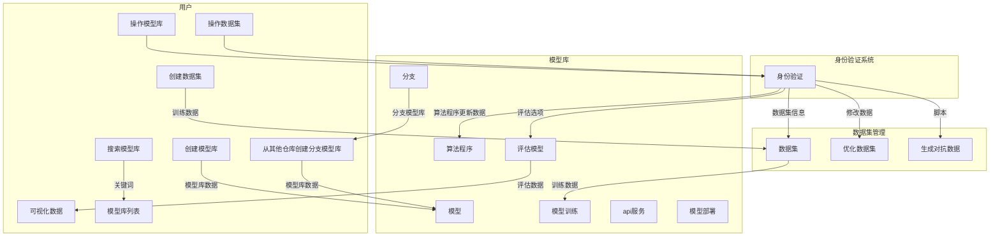
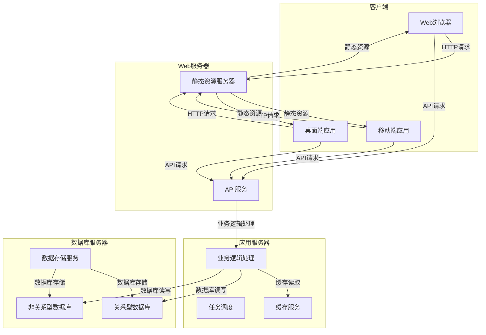
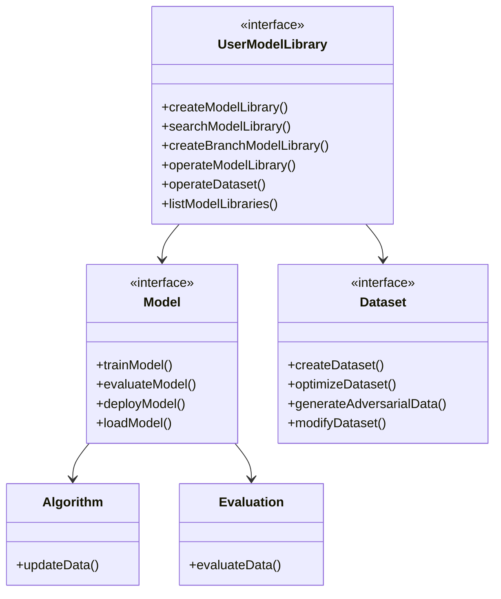
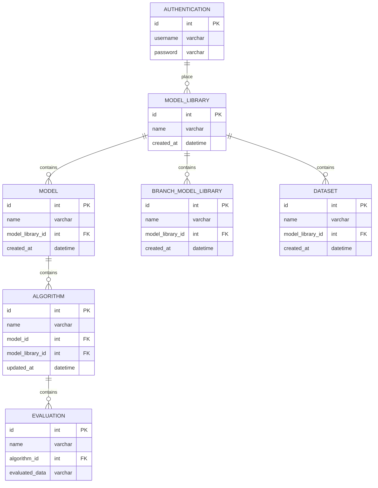
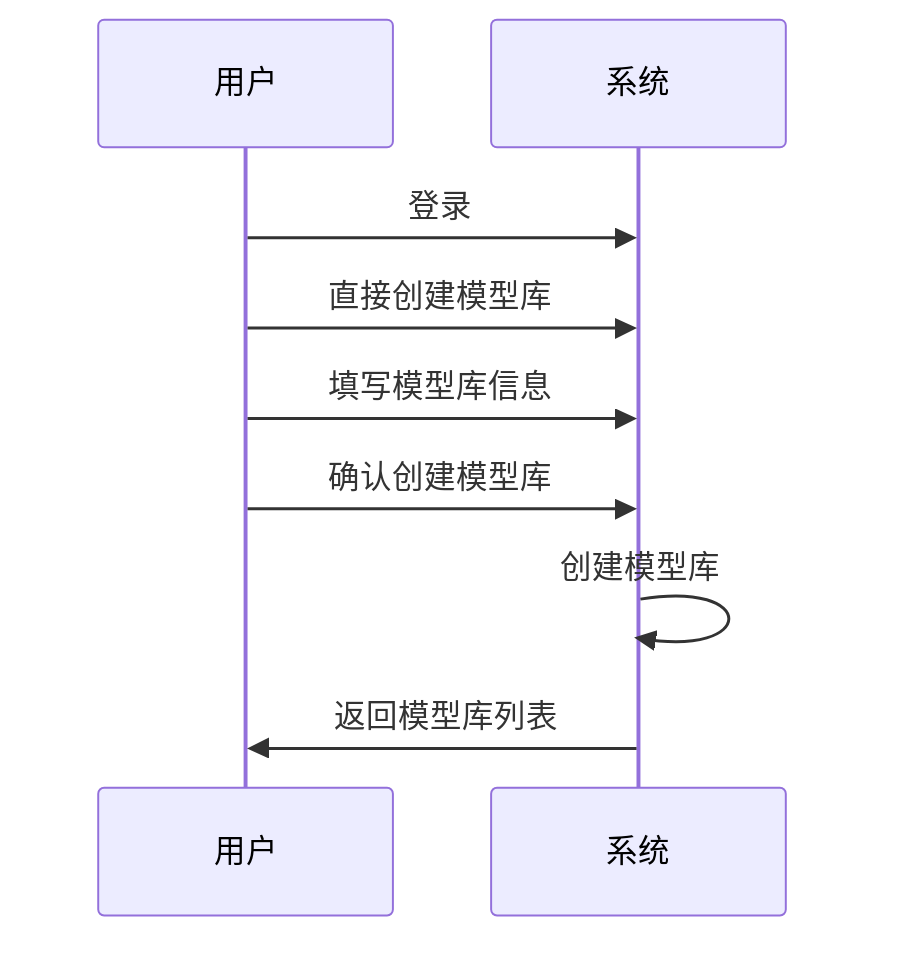
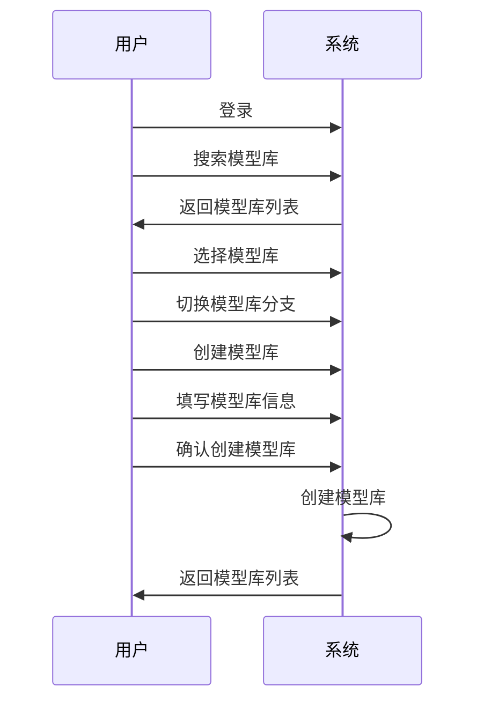
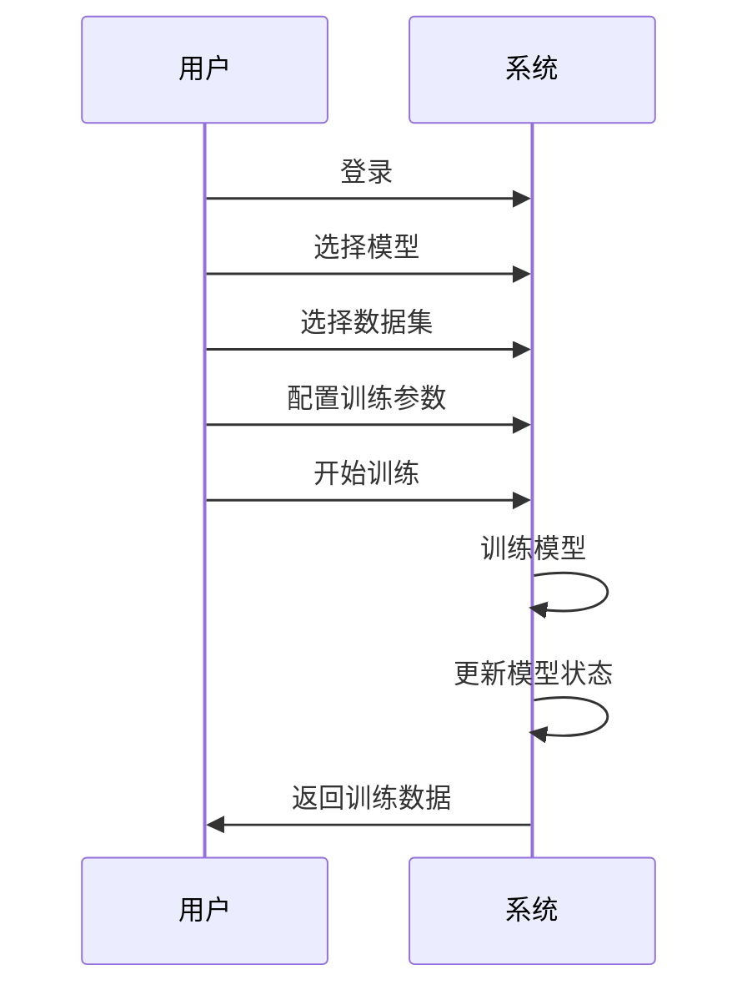

## 一．项目背景及意义

1.1 项目背景

机器学习模型在人工智能领域中扮演着至关重要的角色，然而，训练和优化模型需要大量的计算资源和时间，这对于普通用户来说是一项巨大的挑战。为了解决这个问题，我们提出了一个类似Github的机器学习模型托管系统，该系统使用版本控制和云计算技术，用户可以使用云计算资源训练自己的模型或评估模型的各项指标，也可以使用别人公开预训练的模型。

1.2 项目的研究意义和社会效益

随着人工智能的发展，越来越多的人开始关注和使用机器学习模型。然而，由于训练和优化模型需要大量的计算资源和时间，很多人无法承担这个成本，这限制了机器学习的发展和应用。我们提出的机器学习模型托管系统可以解决这个问题，使机器学习的门槛降低，节省冗余的计算资源，使模型的优化分析更加简单。这将有助于更多人参与到机器学习的研究和应用中，推动人工智能的发展，为社会带来更多的收益。

## 二．国内外现状

目前，世界上已经有很多机器学习平台，例如Google的TensorFlow，Microsoft的Azure Machine Learning，Amazon的SageMaker等。这些平台提供了强大的机器学习工具和资源，使用户可以轻松地构建、训练和部署模型。

然而，国内还没有这样的平台可以轻松地构建、训练和部署模型。这些平台大多是商业性质的，用户需要支付高昂的费用才能使用。此外，这些平台的各个模型的迭代没有统一地管理和分析，用户也不能公开和获取别人公开的模型和分支。

## 三．可行性分析

### 3.1技术可行性分析

机器学习模型托管系统的技术可行性需要考虑以下几个方面：

1. 技术成熟性分析：机器学习技术和云计算技术已经相对成熟，有很多开源框架和云计算平台可以使用，如TensorFlow、PyTorch、Microsoft Azure、Amazon Web Services等。此外，版本控制技术、加密技术和权限控制技术也已经比较成熟，可以应用于机器学习模型的管理和保护。
2. 设备条件分析：机器学习模型托管系统需要在云计算环境中运行，用户需要具备使用云计算服务和工具的能力。为了满足用户的需求，我们需要提供稳定、高速的计算和存储设备，并保证系统的可靠性和可用性。
3. 技术力量分析：机器学习模型托管系统的开发需要涉及多个领域的技术，如机器学习、云计算、数据库、加密、权限控制等。我们需要拥有一支专业的开发团队，掌握多种技术，并能够快速响应用户的需求和反馈。

从以上分析来看，机器学习模型托管系统的技术可行性较高。现有的机器学习和云计算技术已经相对成熟，可以支持系统的开发和运行。我们需要提供稳定、高速的计算和存储设备，并保证系统的可靠性和可用性。此外，我们还需要拥有一支专业的开发团队，掌握多种技术，并能够快速响应用户的需求和反馈。

### 3.2经济可行性分析

机器学习模型托管系统的经济可行性需要考虑以下几个方面：

1. 使用成本分析：机器学习模型托管系统需要在云计算环境中运行，用户需要支付计算资源的使用费用。此外，系统的开发和维护也需要一定的成本。我们需要合理控制使用成本，降低用户的使用门槛，增加用户的使用率和满意度。
2. 收益分析：机器学习模型托管系统可以为用户提供便捷、高效的模型管理和优化服务，提高模型的性能和效果，为用户带来实际的收益。同时，我们还可以通过收取计算资源的使用费用、提供高级功能的付费服务等方式获得收益。
3. 市场规模分析：机器学习技术的应用场景非常广泛，包括金融、医疗、物流、安防等多个领域。随着机器学习技术的不断发展和普及，机器学习模型托管系统的市场规模不断扩大。我们需要对市场需求进行充分的调研和分析，制定合理的市场营销策略，增加市场份额和竞争力。

从以上分析来看，机器学习模型托管系统的经济可行性较高。我们需要合理控制使用成本，增加用户的使用率和满意度，并通过收取计算资源的使用费用、提供高级功能的付费服务等方式获得收益。此外，随着机器学习技术的不断发展和普及，机器学习模型托管系统的市场规模不断扩大，具有良好的市场前景。

### 3.3操作可行性分析

机器学习模型托管系统需要提供用户友好的界面和操作方式，使用户可以轻松地管理和使用模型。从操作角度来看，我们需要考虑以下几个方面：

1. 人员可行性分析：平台的操作需要用户具备一定的机器学习和计算机技术知识，因此，我们需要提供详细的使用说明和培训材料，以便用户了解和掌握系统的操作方式。此外，我们还需要拥有一支专业的技术支持团队，及时解决用户遇到的问题和反馈。
2. 应用环境可行性分析：平台需要在云计算环境中运行，用户需要具备使用云计算服务和工具的能力。为了降低用户的使用门槛，我们需要提供直观、易于使用的界面和操作方式，使用户能够轻松地访问和使用平台的功能。
3. 操作流程可行性分析：平台的操作流程需要简单、明确，以避免用户在使用过程中遇到困难。我们需要设计直观、易于理解的界面和操作流程，使用户能够快速掌握平台的操作方式。
4. 数据安全和隐私保护可行性分析：平台需要采用加密技术和权限控制机制来保护用户数据的安全和隐私。我们需要设计安全可靠的数据管理系统，保护用户数据不被恶意攻击和窃取。

从以上分析来看，机器学习模型托管系统是可行的。我们需要提供详细的使用说明和培训材料，设计直观、易于理解的界面和操作流程，采用加密技术和权限控制机制来保护用户数据的安全和隐私，以提高用户的使用体验和满意度。

### 3.4其他可行性分析

其他可行性分析：

1. 法律可行性分析：机器学习模型托管系统需要遵守相关的法律法规，如数据保护法、知识产权法等。我们需要确保所使用的技术和算法没有涉及到侵犯他人知识产权、隐私等方面的问题，符合法律规定。对于声音拟合和图形生产等模型，我们需要审查模型生成的内容是否符合法律法规和版权问题，以免侵犯他人的知识产权和隐私。
2. 社会可行性分析：机器学习模型托管系统需要满足社会的需求和期望，为用户提供便捷、高效的服务。我们需要注重用户体验和反馈，不断改进和优化系统的功能和性能。同时，我们还需要关注机器学习技术对社会的影响，避免出现不良后果和风险，并积极参与社会责任，为社会做出贡献。

从法律和社会角度分析，本系统本身的技术和算法是基本可行的，但取决于用户如何使用。

## 四．需求分析

### 4.1用户特点分析

机器学习模型托管系统的用户可以分为以下几类：

1. 数据科学家和机器学习工程师：这类用户通常具有深入的机器学习知识和技能，需要使用系统来训练和部署自己的模型。他们需要高度可定制化的模型训练和部署功能，以及强大的计算能力和性能优化功能。
2. 开发者和程序员：这类用户通常需要使用系统来集成机器学习模型到自己的应用程序中。他们需要简单易用的API，以及可靠的模型部署和管理功能。
3. 企业管理者和决策者：这类用户通常需要使用系统来管理和监控团队中的机器学习项目。他们需要可视化的报告和仪表板，以及高效的团队协作和管理工具。
4. AI艺术创作者：他们通常使用机器学习模型来生成艺术作品，需要使用可定制化的模型来实现特定的艺术效果和风格。因此，机器学习模型托管系统需要为这类用户提供可定制化的模型训练和部署功能，以及支持多种艺术效果和风格的模型库。

根据不同的用户群体，机器学习模型托管系统需要提供不同的功能和服务，并针对不同的用户特点进行定制化。例如，对于数据科学家和机器学习工程师，系统需要提供高度可定制化的模型训练和部署功能，以及强大的计算能力和性能优化功能；对于开发者和程序员，系统需要提供简单易用的API，以及可靠的模型部署和管理功能；对于企业管理者和决策者，系统需要提供可视化的报告和仪表板，以及高效的团队协作和管理工具。

### 4.2功能需求分析



### 4.3性能需求分析

1. 响应速度：系统应该具有较快的响应速度，以提升用户体验和工作效率。对于一般的操作，系统应该在1-2秒内响应完成。
2. 并发度：系统应该能够支持大量的并发用户请求。为了保证系统的并发能力，需要使用高性能的服务器和网络设备，使用负载均衡技术和分布式计算技术，以实现系统的横向扩展和负载均衡。。
3. 负载：系统应该能够支持高负载的情况，例如，同时有大量的用户进行模型训练、评估和部署操作。
4. 数据吞吐量：系统应该能够处理大量的数据，包括模型训练和评估所需的数据、数据集、可视化数据等。

为了满足以上性能需求，我们需要进行如下的技术方案设计：

1. 采用分布式系统架构：使用分布式系统架构，将系统拆分成多个独立的模块，并使用消息队列等技术来进行模块间的通信，以提升系统的并发度和负载能力。
2. 引入缓存技术：使用缓存技术，例如Redis等，在系统中缓存常用的数据以提升系统的响应速度和并发度。
3. 采用负载均衡技术：使用负载均衡技术，例如Nginx、HAProxy等，将用户请求分发到不同的服务器上，以提升系统的并发度和负载能力。
4. 采用异步处理技术：使用异步处理技术，例如Celery、RabbitMQ等，将一些耗时的操作异步处理，以避免阻塞主线程，提升系统的并发度和负载能力。
5. 优化数据库和查询：使用索引、分片等技术来优化数据库和查询，以提升系统的响应速度和并发度。

响应时间预测：

| 功能类型 | 闲时响应时间 | 忙时响应时间 | 峰时响应时间 | 预测响应时间 |
| --- | --- | --- | --- | --- |
| 创建模型库 | 0.5秒 | 1秒 | 2秒 | 1秒 |
| 搜索模型库 | 0.5秒 | 1秒 | 2秒 | 1秒 |
| 从模型库创建分支 | 0.5秒 | 1秒 | 2秒 | 1秒 |
| 模型评估 | 5秒 | 10秒 | 15秒 | 10秒 |
| 模型部署 | 5秒 | 10秒 | 15秒 | 10秒 |
| 模型监控 | 3秒 | 5秒 | 10秒 | 5秒 |
| 模型管理 | 2秒 | 4秒 | 8秒 | 4秒 |
| 选择算法 | 0.5秒 | 1秒 | 2秒 | 1秒 |
| 数据集管理 | 2秒 | 4秒 | 8秒 | 4秒 |
| 可视化数据 | 1秒 | 2秒 | 4秒 | 2秒 |
| API服务 | 1秒 | 2秒 | 4秒 | 2秒 |
| 可视化报告 | 2秒 | 4秒 | 8秒 | 4秒 |
| 团队协作 | 2秒 | 4秒 | 8秒 | 4秒 |
| 权限管理 | 1秒 | 2秒 | 4秒 | 2秒 |

### 4.4其他需求分析

本项目的数据安全有较高的要求，因此需要进行以下方面的需求分析：

1. 数据加密：对于敏感数据，需要进行加密处理，以防止数据泄露。可以采用对称加密和非对称加密等技术，保证数据的安全性。
    
2. 用户权限管理：对于不同的用户，需要进行不同的权限管理，以确保用户只能访问他们具有访问权限的数据和功能。
    
3. 访问控制：需要对用户访问系统的权限进行控制，包括对用户身份的验证、对用户访问的资源进行鉴权等。
    
4. 数据备份和恢复：需要对系统的数据进行备份和恢复，以防止数据丢失或损坏。
    
5. 日志记录和审计：需要对系统的操作进行日志记录和审计，以便跟踪和分析系统的使用情况和安全事件。
    
6. 安全漏洞扫描和修复：需要对系统进行安全漏洞扫描和修复，以确保系统的安全性。
    
7. 安全培训和意识：需要对用户进行安全培训和意识教育，以提高用户的安全意识和保护数据的能力。

## 五．总体设计

### 5.1系统环境
#### 5.1.1 开发环境

操作系统：Windows、Linux或MacOS等常见操作系统。

编程语言：Python、GO和TypeScript等常见语言。

开发工具：Visual Studio Code等常见的开发工具。

#### 5.1.2 应用环境

操作系统：Linux配合Docker进行部署，如果有可伸缩的需求，则使用Kubernetes。

数据库：PostgreSQL一种高级关系型数据库，它具有高度的可靠性、可扩展性和安全性，并支持复杂的数据类型和查询

### 5.2系统架构设计



### 5.3功能模块设计（或类图）

根据您的要求，以下是从数据流图到功能模块图的转换，并给出了模块接口设计，使用了Mermaid的类图语法。


功能模块图：



模块接口设计：
#### 模型库UserModelLibrary

  - createModelLibrary()：创建模型库
  - searchModelLibrary()：搜索模型库
  - createBranchModelLibrary()：从其他仓库创建分支模型库
  - operateModelLibrary()：操作模型库
  - operateDataset()：操作数据集
  - listModelLibraries()：列出模型库列表
#### 模型Model
  - trainModel()：训练模型
  - evaluateModel()：评估模型
  - deployModel()：部署模型
  - loadModel()：加载模型
#### Algorithm
  - updateData()：更新算法程序所需的数据
- Evaluation
  - evaluateData()：评估数据
#### 数据集 Dataset
  - createDataset()：创建数据集
  - optimizeDataset()：优化数据集
  - generateAdversarialData()：生成对抗数据
  - modifyDataset()：修改数据集

### 5.4数据库设计

## 概念结构设计（ER 图）



## 逻辑结构设计（表结构）

根据上述 ER 图，我们可以得到以下逻辑结构设计的表结构：

### MODEL_LIBRARY

| 列名 | 数据类型 | 约束条件 | 说明 |
| ---- | ------- | ------- | --- |
| id | int | PK | 模型库 ID |
| name | varchar | NOT NULL | 模型库名称 |
| created_at | datetime | NOT NULL | 模型库创建时间 |

### MODEL

| 列名 | 数据类型 | 约束条件 | 说明 |
| ---- | ------- | ------- | --- |
| id | int | PK | 模型 ID |
| name | varchar | NOT NULL | 模型名称 |
| model_library_id | int | NOT NULL, FK(MODEL_LIBRARY.id) | 所属模型库 ID |
| created_at | datetime | NOT NULL | 模型创建时间 |

### BRANCH_MODEL_LIBRARY

| 列名 | 数据类型 | 约束条件 | 说明 |
| ---- | ------- | ------- | --- |
| id | int | PK | 分支模型库 ID |
| name | varchar | NOT NULL | 分支模型库名称 |
| model_library_id | int | NOT NULL, FK(MODEL_LIBRARY.id) | 所属模型库 ID |
| created_at | datetime | NOT NULL | 分支模型库创建时间 |

### ALGORITHM

| 列名 | 数据类型 | 约束条件 | 说明 |
| ---- | ------- | ------- | --- |
| id | int | PK | 算法程序 ID |
| name | varchar | NOT NULL | 算法程序名称 |
| model_id | int | NOT NULL, FK(MODEL.id) | 所属模型 ID |
| updated_at | datetime | NOT NULL | 算法程序更新时间 |

### EVALUATION

| 列名 | 数据类型 | 约束条件 | 说明 |
| ---- | ------- | ------- | --- |
| id | int | PK | 评估结果 ID |
| name | varchar | NOT NULL | 评估结果名称 |
| model_library_id | int | NOT NULL, FK(MODEL_LIBRARY.id) | 所属模型库 ID |
| algorithm_id | int | NOT NULL, FK(ALGORITHM.id) | 所属算法程序 ID |
| evaluated_data | varchar | NOT NULL | 评估结果数据 |

### DATASET

| 列名 | 数据类型 | 约束条件 | 说明 |
| ---- | ------- | ------- | --- |
| id | int | PK | 数据集 ID |
| name | varchar | NOT NULL | 数据集名称 |
| model_library_id | int | NOT NULL, FK(MODEL_LIBRARY.id) | 所属模型库 ID |
| created_at | datetime | NOT NULL | 数据集创建时间 |

### AUTHENTICATION

| 列名 | 数据类型 | 约束条件 | 说明 |
| ---- | ------- | ------- | --- |
| id | int | PK | 身份验证 ID |
| username | varchar | NOT NULL | 用户名 |
| password | varchar | NOT NULL | 密码 |


## 六．详细设计

### 6.1模块1创建模型库流程设计

#### 直接创建模型库



在这个流程中，用户需要登录系统，然后选择直接创建新的模型库。在填写模型库信息之后，用户需要确认创建模型库。系统在收到确认信息后，会创建新的模型库，并返回模型库列表给用户。

#### 先搜索模型库，选择模型库，切换模型库分支创建模型库




### 6.2模块2流程设计



在这个流程中，用户需要先登录系统，然后选择要训练的模型和数据集。用户需要配置训练参数，例如学习率、批次大小等。用户确认配置后，可以开始训练模型。系统会根据用户的配置训练模型，并更新模型状态。最后，系统会返回训练结果给用户。

### 6.3关键算法设计
- 版本控制
```
# 定义一个仓库类，用于存储文件和提交记录
class Repository:
    def __init__(self, name):
        self.name = name  # 仓库名称
        self.files = {}  # 存储文件的字典
        self.commits = []  # 存储提交记录的列表

    # 添加文件到仓库
    def add_file(self, file_name, content):
        self.files[file_name] = content

    # 从仓库中删除文件
    def remove_file(self, file_name):
        del self.files[file_name]

    # 创建一个提交记录
    def create_commit(self, message):
        commit = Commit(message, self.files)  # 创建一个新的提交记录
        self.commits.append(commit)  # 将新的提交记录添加到提交记录列表中
        return commit

    # 根据提交记录的哈希值查找提交记录
    def get_commit(self, commit_hash):
        for commit in self.commits:
            if commit.hash == commit_hash:
                return commit
        return None

# 定义一个提交记录类，用于存储提交信息和文件快照
class Commit:
    def __init__(self, message, files):
        self.message = message  # 提交信息
        self.files = files  # 文件快照
        self.hash = hash(self.message + str(self.files))  # 根据提交信息和文件快照计算哈希值

# 定义一个分支类，用于管理分支信息
class Branch:
    def __init__(self, name, commit):
        self.name = name  # 分支名称
        self.head = commit  # 分支指向的提交记录

    # 设置分支指向的提交记录
    def set_head(self, commit):
        self.head = commit

# 定义一个Git类，用于管理仓库和分支等信息
class Git:
    def __init__(self):
        self.repositories = {}  # 存储仓库的字典
        self.branches = {}  # 存储分支的字典

    # 创建一个新的仓库
    def create_repository(self, name):
        repo = Repository(name)  # 创建一个新的仓库
        self.repositories[name] = repo  # 将新的仓库添加到仓库字典中
        return repo

    # 创建一个新的分支
    def create_branch(self, repo_name, branch_name, commit):
        branch = Branch(branch_name, commit)  # 创建一个新的分支
        self.branches[(repo_name, branch_name)] = branch  # 将新的分支添加到分支字典中

    # 根据仓库名称获取仓库对象
    def get_repository(self, name):
        return self.repositories.get(name)

    # 根据仓库名称和分支名称获取分支对象
    def get_branch(self, repo_name, branch_name):
        return self.branches.get((repo_name, branch_name))

    # 切换到指定的分支
    def checkout(self, repo_name, branch_name):
        branch = self.get_branch(repo_name, branch_name)  # 获取指定分支对象
        repo = self.get_repository(repo_name)  # 获取指定仓库对象
        if branch and repo:
            repo.files = branch.head.files  # 将仓库的文件快照设置为指定分支的文件快照
```

- 云计算训练模型
```
# 用户登录
user.login()

# 用户选择模型和数据集
model = user.select_model()
dataset = user.select_dataset()

# 用户配置训练参数
hyperparameters = user.configure_hyperparameters()

# 连接云计算资源
ssh.connect()

# 开始训练模型
training_data = dataset.load_training_data()
model.train(training_data, hyperparameters)

# 更新模型状态
model.update_status()

# 返回训练数据
training_results = model.get_training_results()
user.show_training_results(training_results)
```

## 七．总结与收获

本项目是一项基于云计算、版本控制和机器学习算法的模型托管系统，致力于降低机器学习门槛、节省计算资源和推动人工智能的发展。我们提出了一种类似Github的机器学习模型托管系统，使用版本控制和云计算技术，使用户可以使用云计算资源训练自己的模型或评估模型的各项指标，也可以使用别人公开预训练的模型。在项目的设计中，我们考虑了用户需求、系统架构、模型存储和安全等方面，制定了详细的规划和设计方案，为后续的开发工作奠定了基础。

本项目的研究意义和社会效益在于，它能够解决机器学习门槛高、计算资源浪费等问题，使更多人参与到机器学习的研究和应用中，推动人工智能的发展。同时，本项目还可以帮助个人、企业和组织更好地管理和优化自己的机器学习模型，提高模型的效率和准确性，为社会带来更多的收益

在下一步的开发中，我计划进一步完善系统的功能和性能，增加更多的机器学习算法和模型，提高系统的可扩展性和稳定性。我还计划优化系统的用户界面和用户体验，使用户可以更轻松地使用和管理自己的模型。

- 本文只是设计了系统架构图和关键算法，实际开发中，目前为止我们实现了单台服务器的部署。对于系统的分布式部署、冗余、限流、负载均衡等细节本文仍未提及，需要进一步开发，以验证其可行和有效性
- 在云计算方面，为了能够进行大规模的模型训练，需要大量的计算资源和人力资源，对这些资源的管理和动态调用是一件很困难的事情，本文还没有涉及这方面的问题，在未来的研究过程中，还应该着力解决这方面的问题
同样，在思考和完成本项目的设计时，我也收获了不少前沿知识，比如：
- 我学习了Git和SVN等常用的版本控制工具，以及它们的工作原理和使用方法。我还学习了分布式版本控制和协同开发的相关知识，这些都为我今后的软件开发工作提供了很好的基础和指导。

- 我不仅学习了云计算的基础知识和应用场景，还了解了云计算的反面知识，比如云计算的安全和隐私问题、云厂商的锁定效应等。这些知识对我今后的云计算应用和开发工作都有很大的参考价值。

## 八．参考文献

[1]Matthew D. Beckman, Mine Çetinkaya-Rundel, Nicholas J. Horton, Colin W. Rundel, Adam J. Sullivan, Maria Tackett https://arxiv.org/pdf/2001.01988.pdf
[2]Naweiluo Zhou , Florent Dufour , Vinzent Bode , Peter Zinterhof , Nicolay J Hammer , Dieter Kranzlmüller https://arxiv.org/pdf/2305.17761.pdf
[3] Neelesh Mungoli https://arxiv.org/pdf/2304.13738.pdf
[4]李坤、 李志春、 陈越涛、 王子轩、 张一伟、 袁亮、 贾海鹏、 张云泉、 曹婷、 毛洋 https://arxiv.org/pdf/2303.08365.pdf
[5]Anne Henning、 Lukas Schulte、 Steffen Herbold、 Oksana Kulyk、 Peter Mayer https://arxiv.org/pdf/2304.06367.pdf
[6]Samuel Prescott、 Adrian Wheeldon、 Rishad Shafik、 Tousif Rahman、 Alex Yakovlev、 Ole-Christoffer Granmo https://arxiv.org/pdf/2306.01027.pdf