## 实验目的

1. 能够使用逻辑覆盖测试分析和设计测试用例
2. 能够使用路径覆盖测试分析和设计测试用例

## 实验原理

> [!NOTE]
> 白盒测试是知道产品内部工作过程，检测产品内部动作是否按照规格说明书的规定正  常进行。 白盒测试允许测试人员利用程序内部的逻辑结构及有关信息，设计或选择测试用例，对程序所有逻辑路径进行测试。通过在不同点检查程序的状态，确定实际的状态是否与预期的状态一致。 

### 逻辑覆盖 

白盒测试力求提高测试覆盖率。逻辑覆盖是对一系列测试过程的总称，它是在使用白盒测试法时，选用测试用例执行程序逻辑路径的方法。 

逻辑覆盖按覆盖程度由低到高大致分为以下几类： 

1. 语句覆盖：语句覆盖就是设计若干个测试用例，运行被测程序，使得每一可执行语句至少执行一次； 

2. 判断覆盖： 

	判定覆盖就是设计若干个测试用例，运行被测程序，使得程序中每个判断的取真分支和取假分支至少经历一次； 
	
	判定覆盖又称为分支覆盖； 

3. 条件覆盖：往往大部分的判定语句是由多个逻辑条件组合而成，若仅仅判断其整个最终结果，而忽略每个条件的取值情况，必然会遗漏部分测试路径。判定覆盖仍是弱的逻辑覆盖； 

4. 判断 /条件覆盖： 

	判定/条件覆盖实际上是将判定覆盖和条件覆盖结合起来的一种方法； •就是设计足够的测试用例，使得判断中每个条件的所有可能取值至少执行一次，同时每个判定的可能结果也至少出现一次； •设计测试用例覆盖4个条件的8种取值以及4个判定分支； 

5. 条件组合覆盖。条件组合覆盖就是设计足够的测试用例，运行被测程序，使得每个判断的所有可能的条件取值组合至少执行一次； 

6. 路径覆盖。设计足够的测试用例，使程序的每条可能路径都至少执行一次。 如果把路径覆盖和条件组合覆盖结合起来，可以设计出过检错能力更强的测试数据用例。 

### 基本路径测试 

> [!NOTE]
> 路径测试就是从一个程序的入口开始，执行所经历的各个语句的完整过程。从广义的角度讲，任何有关路径分析的测试都可以被称为路径测试。独立路径是指从程序的入口到出口的多次执行中，每次至少有一个语句是新的，未被重复的，也即每次至少要经历一条从末走过的弧。 
> 在不能做到所有路径覆盖的前提下，如果某一程序的每一个独立路径都被测试过，那么可以认为程序中的每个语句都已经检验过了，即达到了语句覆盖。这种测试方法就是基本路径测试方法。 
> 基本路径测试方法是在控制流图的基础上，通过分析控制结构的环形复杂度，导出执行路径的基本集，再从该基本集设计测试用例。 

基本路径测试方法包括4个步骤： 

1. 画出程序的控制流图。 
2. 计算程序的环形复杂度，导出程序基本路径集中的独立路径条数，确定程序中每个可执行语句至少执行一次所必须的测试用例数目的上界。 
3. 导出基本路径集，确定程序的独立路径。独立路径至少包含一条在之前不曾用到的边。 
4. 根据（3）中的独立路径，设计测试用例的输入数据和预期输出。 

> 控制流图（简称流图）是对程序流程图进行简化后得到的，它可以更加突出的表示程序控制流的结构。控制流图中包括两种图形符号：

#### 节点 

> [!NOTE]
> 节点由带标号的圆圈表示，可代表一个或多个语句、一个处理框序列和一个条件判定框（假设不包含复合条件）。 
> 节点表示一个或多个无分支的语句或源程序语句。 

#### 控制流线 

	控制流线由带箭头的弧或线表示，可称为边。它代表程序中的控制流。对于复合条件，则可将其分解为多个单个条件，并映射成控制流图。 


 

#### 常见结构的控制流图 


程序流程图与对应的控制流图 

### 环形复杂度 

> [!NOTE]
> 环形复杂度也称为圈复杂度，它是一种为程序逻辑复杂度提供定量尺度的软件度量。应用：进行程序的基本路径测试时，程序的环路复杂性给出了程序基本路径集合中的独立路径条数，这是确保程序中每个可执行语句至少执行一次所必须的测试用例数目的上界。  

进行程序的基本路径测试时，程序的环路复杂性给出了程序基本路径集合中的独立路径条数，这是确保程序中每个可执行语句至少执行一次所必需的测试用例数目的上界。 

环形复杂度以图论为基础，为我们提供了非常有用的软件度量。可用如下三种方法之一来计算环形复杂度。 

1. 控制流图中区域的数量对应于环形复杂度。 

2. 给定控制流图G的环形复杂度——`V(G)`，定义为`V(G) = E-N+2`,其中，E是控制流图中边的数量，N是控制流图中的节点数量。 

3. 给定控制流图G的环形复杂度——`V(G)`，也可定义为`V(G)= P+1`,其中，P是控制流图G中判定节点的数量。

## 实验过程
### 题目一：使用逻辑覆盖测试方法测试以下程序段
```go
func Function(a, b, c int) int {
	if a > 1 && b == 0 {
		c /= a
	}
	if a == 5 || c > 1 {
		c += 1
	}
	return a + b + c
}
```

#### 画出程序控制流图

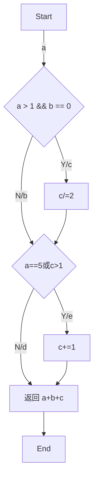

#### 语句覆盖
	语句覆盖（在语句覆盖测试用例中，使程序中每个可执行语句至少被执行一次。）
- 测试用例

| 测试用例  | 覆盖路径 | 预期结果 |
|----------|---------|----------|
| a=2,b=0,c=4 | a,c,e | 5 |

#### 判定覆盖

	判定覆盖(使得每个判定语句的取值都满足各有一次“真”与“假”)
- 测试用例

| 测试用例 | 覆盖路径 | 预期结果 |
| --- | --- | --- |
| a=2,b=0,c=4 | a, c, e | 5 |
| a=-4, b=3, c=-5 | a, b, d | -6 |
| a=3, b=0, c=-6 | a, c, d | 1 |
| a=5, b=1, c=0| a, b, e | 7 |

#### 条件覆盖
	设计测试用例时，要保证每种状态都至少出现一次。设计测试用例的原则是尽量以最少的测试用例达到最大的覆盖率
- 条件列表

| 条件一 | 条件标记 | 条件二 | 条件标记 |
|--------|---------|--------|---------|
| a>1    | S1      | b=0    | S3      |
| a<=1   | -S1     | b!=0   | -S3     |
| a=5    | S2      | c>1    | S4      |
| a!=5   | -S2     | c<=1   | -S4     |

- 测试用例

| 测试用例 | 条件标记 | 执行路径 | 预期结果 |
| --- | --- | --- | --- |
| a=2,b=0,c=4 | S1, -S2, S3, S4 | a, c, e | 5 |
| a=-4, b=3, c=-5 | -S1,-S2,-S3,-S4 | a, b, d | -6 |
| a=3, b=0, c=-6 | S1,- S2, S3, -S4 | a, c, d | 1 |
| a=5, b=1, c=0| S1, S2, -S3, -S4| a, b, e | 7 |
#### 判断/条件覆盖
	设计用例，使得判断中的每个条件的所有可能结果至少出现一
	次，而且判断本身所有可能结果也至少出现一次

| 测试用例 | 条件标记 | 执行路径 | 预期结果 |
| --- | --- | --- | --- |
| a=2,b=0,c=4 | S1, -S2, S3, S4 | a, c, e | 5 |
| a=-4, b=3, c=-5 | -S1,-S2,-S3,-S4 | a, b, d | -6 |
| a=3, b=0, c=-6 | S1,- S2, S3, -S4 | a, c, d | 1 |
| a=5, b=1, c=0| S1, S2, -S3, -S4| a, b, e | 7 |
#### 条件组合覆盖
	1. 设计足够多的测试用例，使判定语句中每个条件的所有可能至少出现一次，并且每个判定语句本身的判定结果也至少出现一次   
	2. 由于四个条件每个条件都有取“真”、“假”两个值，因此所有条件结果的组合有24=16种

|  序号    |  组合              | 测试用例           | 预期结果 |
|:-------|:-----------------|:---------------|:-----|
|  1     |  S1，S2，S3，S4     | a=5 ,b=0 c=2   |    6 |
|  2     |  -S1，S2，S3，S4    | 不可能            |      |
|  3     |  S1，-S2，S3，S4    |  a=2, b=0, c=2 |    3 |
|  4     |  S1，S2，-S3，S4    | a=5, b=1, c=2  |    9 |
|  5     |  S1，S2，S3，S4     | a=5, b=0, c=1  |    6 |
|  6     |  -S1，-S2，S3, S4  |  a=1, b=0, c=2 |    4 |
|  7     |  -S1，S2，-S3，S4   | 不可能            |      |
|  8     |  -S1，S2，S3，-S4   | 不可能            |      |
|  9     |  S1，-S2，-S3，S4   | a=2, b=1, c=2  |    6 |
|  10    |  S1，S2，-S3，-S4   | a=5,b=1,c=1    |    8 |
|  11    |  S1，-S2，S3，-S4   |  a=2, b=0, c=1 |    2 |
|  12    |  -S1，-S2，-S3，S4  |  a=1, b=1, c=2 |    5 |
|  13    |  -S1，-S2，S3，-S4  |  a=1, b=0, c=1 |    2 |
|  14    |  S1，-S2，-S3，-S4  |  a=3, b=2, c=1 |    6 |
|  15    |  -S1，S2，-S3，-S4  | 不可能            |      |
|  16    |  -S1，-S2，-S3，-S4 |  a=1, b=1, c=1 |    3 |  
#### 测试程序
```go
package whitebox

import (
	"testing"
)

func TestFunction_1(t *testing.T) {
	testCases := []struct {
		a, b, c int
		expectedResult int
	}{
		// 语句覆盖
		{2, 0, 4, 5},
		// 判定覆盖
		{2, 0, 4, 5},
		{-4, 3, -5, -6},
		{3, 0, -6, 1},
		{5, 1, 0, 7},
		// 条件覆盖
		{2, 0, 4, 5},
		{-4, 3, -5, -6},
		{3, 0, -6, 1},
		{5, 1, 0, 7},
		// 判定-条件覆盖
		{2, 0, 4, 5},
		{-4, 3, -5, -6},
		{3, 0, -6, 1},
		{5, 1, 0, 7},
		// 条件组合覆盖
		{5, 0, 2, 6},
		{2, 0, 2, 3},
		{5, 1, 2, 9},
		{5, 0, 1, 6},
		{1, 0, 2, 4},
		{2, 1, 2, 6},
		{5, 1, 1, 8},
		{2, 0, 1, 2},
		{1, 1, 2, 5},
		{1, 0, 1, 2},
		{3, 2, 1, 6},
		{1, 1, 1, 3},
	}

	for _, tc := range testCases {
		if res := Function_1(tc.a , tc.b, tc.c); res != tc.expectedResult {
			t.Errorf("Function_1(%d, %d, %d); 期望输出 %d; 实际输出 %d", tc.a, tc.b, tc.c, tc.expectedResult, res)
		}
	}
}
```

### 题目二：三角形问题

	在三角形计算中，要求输入三角型的三个边长： A、B 和 C。当三边不可能构成三角形时
	提示错误，可构成三角形时计算三角形周长。若是等腰三角形打印“等腰三角形” ，若是
	等边三角形，则提示“等边三角形”。画出程序流程图、控制流程图、计算圈复杂度 V(g) ，
	找出基本测试路径

#### 测试程序

```go
func JudgeTriangle(a, b, c int) string {
	if a <= 0 || b <= 0 || c <= 0 {
		return "非法输入"
	}
	if a+b <= c || a+c <= b || b+c <= a {
		return "无法构成三角形"
	} else if a == b || a == c || b == c {
		if a == b && b == c {
			return "等边三角形"
		} else {
			return "等腰三角形"
		}
	} else if a*a+b*b == c*c || a*a+c*c == b*b || b*b+c*c == a*a {
		return "直角三角形"
	} else {
		return "普通三角形"
	}
}
```

#### 程序流程图


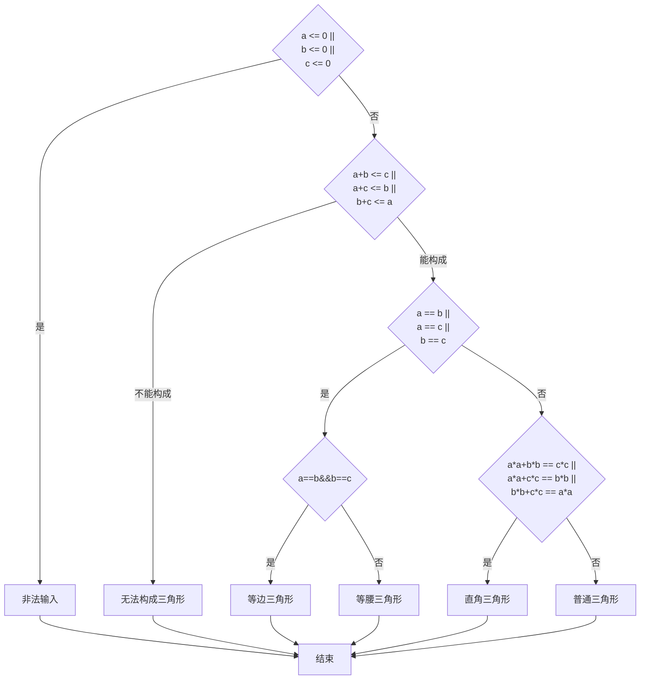
#### 分离程序流图

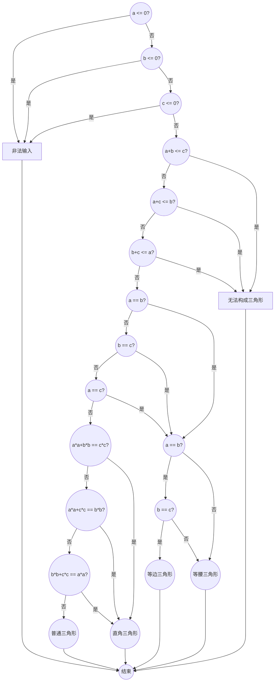

#### 控制流图

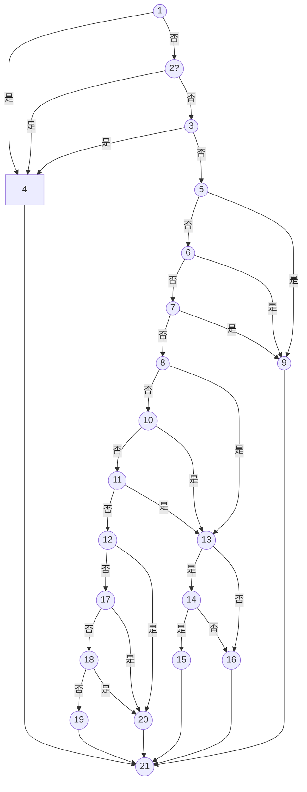
- 根据控制流图，边数E=34, 结点数N=21，判断结点数P=14,`v(g)=E-N+2=15, v(g)=P+1=15`
- 由控制流图可得独立路径有

| 编号 | 包含路径 |  
|:-----:|:---------|
|	1 | 1 -> 4 -> 21 |
|	2| 2 -> 4 -> 21 |
|	3| 3 -> 4 -> 21 |
|	4| 5 -> 9 -> 21 |
|	5| 6 -> 9 -> 21 |
|	6| 7 -> 9 -> 21 |
|	7 | 8 -> 13 -> 16 -> 21 （不可能）|
|	8 | 8 -> 13 -> 14 -> 16 -> 21|
|	9 |8 -> 13 -> 14 -> 15 -> 21|
|	10 | 10 -> 13 -> 16 -> 21 |
|	11. |11 -> 13 -> 16 -> 21 |
|	12 |12 -> 20 -> 21 |
|	13 | 17 -> 20 -> 21 |
|	14 |18 -> 20 -> 21 |
|	15 | 18 -> 19 -> 21 |

#### 设计测试用例

| a | b | c | 预期结果    | 覆盖路径 |
|:--|:--|:--|:--------|:-----|
| 0 | 1 | 2 | 非法输入    |    1 |
| 1 | 0 | 2 | 非法输入    |    2 |
| 1 | 2 | 0 | 非法输入    |    3 |
| 1 | 2 | 3 | 无法构成三角形 |    4 |
| 1 | 3 | 2 | 无法构成三角形 |    5 |
| 3 | 1 | 2 | 无法构成三角形 |    6 |
| 5 | 5 | 6 | 等腰三角形   |    8 |
| 5 | 5 | 5 | 等边三角形   |    9 |
| 6 | 5 | 5 | 等腰三角形   |   10 |
| 5 | 6 | 5 | 等腰三角形   |   11 |
| 3 | 4 | 5 | 直角三角形   |   12 |
| 3 | 5 | 4 | 直角三角形   |   13 |
| 5 | 3 | 4 | 直角三角形   |   14 |
| 5 | 6 | 7 | 普通三角形   |   15 |  

#### 测试程序

```go
package whitebox

import "testing"


 func TestJudgeTriangle(t *testing.T) {
	testCases := []struct {
		a, b, c int
		expectedResult string
	}{
		{0, 1, 2, "非法输入"},
		{1, 0, 2, "非法输入"},
		{1, 2, 0, "非法输入"},
		{1, 2, 3, "无法构成三角形"},
		{1, 3, 2, "无法构成三角形"},
		{3, 1, 2, "无法构成三角形"},
		{5, 5, 6, "等腰三角形"},
		{5, 5, 5, "等边三角形"},
		{6, 5, 5, "等腰三角形"},
		{5, 6, 5, "等腰三角形"},
		{3, 4, 5, "直角三角形"},
		{3, 5, 4, "直角三角形"},
		{5, 3, 4, "直角三角形"},
		{5, 6, 7, "普通三角形"},
	}

	for _, tc := range testCases {
		result := JudgeTriangle(tc.a, tc.b, tc.c)
		if result != tc.expectedResult {
			t.Errorf("judgeTriangle(%d, %d, %d), 期望输出： %s, 实际输出：%s",
				tc.a, tc.b, tc.c, tc.expectedResult, result)
		}
	}
}
```

### 题目三：使用基本路径测试方法，为以下程序段设计测试用例。 

```go
package whitebox

func Do(x, a, b int) int {
	if a > 1 && b == 0 {
		x = x / a
	}
	if a == 2 || x > 1 {
		x = x + 1
	}
	return x
}
```

### 程序流程图

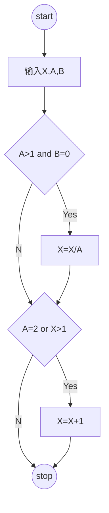
#### 分离流程图

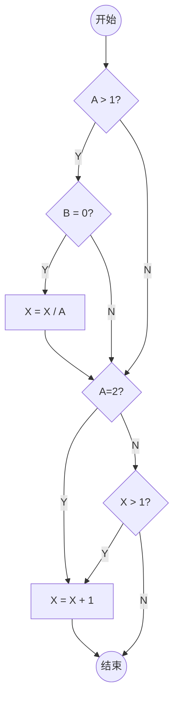

#### 控制流图

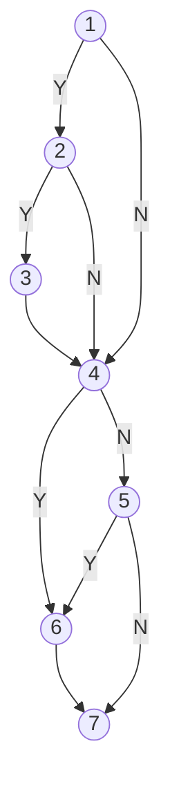

	一条独立路径是指，和其他的独立路径相比，至少引入一个新处理语句或一个新判断的程序通路。V(G)值正好等于该程序的独立路径的条数。
- 根据程序流图，边数`E=10` 结点数`N=7`, 判断结点数`P=4`,`v(g)=E-N+2=5, v(g) = P+1 = 5`
- 由图可知独立路径有
	1. `1-4-5-7`
	2. `1-4-5-6-7`
	3. `1-2-4-6-7`
	4. `1-2-4-5-7`
	5. `1-2-3-4-5-7`

#### 设计测试用例

| X | A | B | 预期结果 | 覆盖路径 |
|:--|:--|:--|:-----|:-----|
| 0 | 0 | 0 |    0 |    1 |
| 2 | 0 | 0 |    3 |    2 |
| 0 | 2 | 1 |    1 |    3 |
| 0 | 3 | 1 |    0 |    4 |
| 3 | 3 | 0 |    1 |    5 |  

#### 测试程序
```go
package whitebox

import "testing"

func TestDo(t *testing.T) {
	testCases := []struct {
		x, a, b int
		expectedResult int
	}{
		{0, 0, 0, 0},
		{2, 0, 0, 3},
		{0, 2, 1, 1},
		{0, 3, 1, 0},
		{3, 3, 0, 1},
	}

	for _, tc := range testCases {
		if res := Do(tc.x , tc.a, tc.b); res != tc.expectedResult {
			t.Errorf("Do(%d, %d, %d); 期望输出 %d; 实际输出 %d", tc.x, tc.a, tc.b, tc.expectedResult, res)
		}
	}
}
```


### 题目三：计算生日是星期几

	已知公元 1 年 1 月 1 日是星期一。 编写一个程序， 只要输入年月日， 就能回答那天
	是星期几。应用逻辑覆盖方法和基路径测试方法为上面的问题设计测试用例。

#### 被测程序

```go
package whitebox

import "time"

func GetWeekday(year, month, day int) string {
	start := time.Date(1, 1, 1, 0, 0, 0, 0, time.UTC)
	// 将输入的年份、月份、日期转换为 time.Time 类型对象
    end := time.Date(year, time.Month(month), day, 0, 0, 0, 0, time.Local)
	// 判断日期是否合法
    if end.Year() != year || end.Month() != time.Month(month) || end.Day() != day {
        return "输入日期不合法"
    }
	diff := end.Sub(start)
	hours := int(diff.Hours())
	days := hours / 24
	weekday := days % 7

	switch weekday {
	case 0:
		return "星期一"
	case 1:
		return "星期二"
	case 2:
		return "星期三"
	case 3:
		return "星期四"
	case 4:
		return "星期五"
	case 5:
		return "星期六"
	case 6:
		return "星期日"
	default:
		return ""
	}
}
```

#### 控制流程图

	由于输入日期是否合法在黑盒测试中已经测试过，所以把判断输入日期是否合法看作一条判断语句

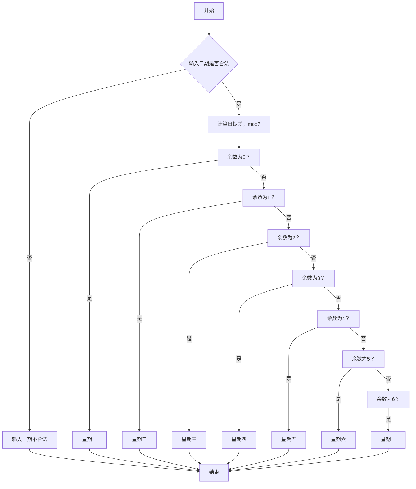


#### 语句覆盖

| 年 | 月 | 日 | 预期输出 |
|:--|:--|:--|:-----|
| 1 | 1 | 7 | 星期日  |  

#### 判定覆盖

- 测试用例

|  年  |  月  |  日  |  预期输出   |
|:----|:----|:----|:--------|
|  1  |  1  |  7  |  星期日    |
|   1 |   1 |   6 | 星期六     |
|   1 |   1 |   5 | 星期五     |
|   1 |   1 |   4 | 星期四     |
|   1 |   1 |   3 | 星期三     |
|   1 |   1 |   2 | 星期二     |
|   1 |   1 |   1 | 星期一     |
|   1 |   2 |  30 | 输入日期不合法 |  

#### 条件覆盖

- 条件列表

|  条件1：日期 |  条件标记  |
|:--------|:-------|
| 合法      | A1     |
| 非法      | A2     |  

|  条件2：余数weekday |  条件标记  |
|:-------------:|:-------|
|              0 | B1     |
|              1 | B2     |
|              2 | B3     |
|              3 | B4     |
|              4 | B5     |
|              5 | B6     |
|              6 | B7     |  

- 测试用例

|  年  |  月  |  日  |  预期输出   |
|:----|:----|:----|:--------|
|  1  |  1  |  7  |  星期日    |
|   1 |   1 |   6 | 星期六     |
|   1 |   1 |   5 | 星期五     |
|   1 |   1 |   4 | 星期四     |
|   1 |   1 |   3 | 星期三     |
|   1 |   1 |   2 | 星期二     |
|   1 |   1 |   1 | 星期一     |
|   1 |   2 |  30 | 输入日期不合法 |  

#### 判断/条件覆盖

|  年  |  月  |  日  |  预期输出   |
|:----|:----|:----|:--------|
|  1  |  1  |  7  |  星期日    |
|   1 |   1 |   6 | 星期六     |
|   1 |   1 |   5 | 星期五     |
|   1 |   1 |   4 | 星期四     |
|   1 |   1 |   3 | 星期三     |
|   1 |   1 |   2 | 星期二     |
|   1 |   1 |   1 | 星期一     |
|   1 |   2 |  30 | 输入日期不合法 |  

#### 条件组合覆盖
`由于每一个条件都是独立互斥的，无法进行组合，测试用例与条件覆盖一致`

#### 控制流图

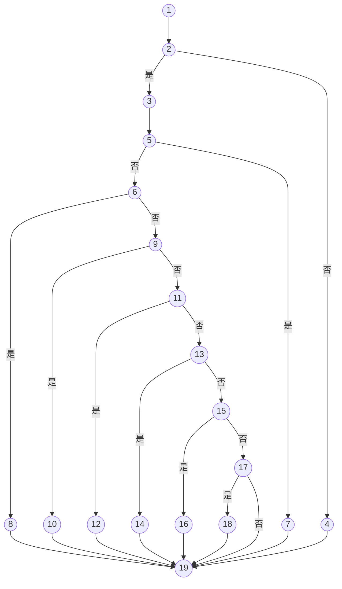


#### 独立路径
- 根据程序流图，边数`E=26` 结点数`N=19`, 判断结点数`p=8`, `V(g)=E-N+2=9, v(g) = P+1 = 9`

| 编号 | 路径                   |
|:---|:---------------------|
|  1 | 1-&gt;2-&gt;4-&gt;19 |
|  2 |       5-&gt;7-&gt;19 |
|  3 |       6-&gt;8-&gt;19 |
|  4 |      9-&gt;10-&gt;19 |
|  5 |     11-&gt;12-&gt;19 |
|  6 |     13-&gt;14-&gt;19 |
|  7 |     15-&gt;16-&gt;19 |
|  8 |     17-&gt;18-&gt;19 |
|  9 |            17-&gt;19 |  

#### 设计测试用例

|  年  |  月  |  日  |  预期输出   | 覆盖路径 |
|:----|:----|:----|:--------|:-----------|
|  1  |  1  |  7  |  星期日    | 8 | 
|   1 |   1 |   6 | 星期六     | 7 |
|   1 |   1 |   5 | 星期五     | 6 |
|   1 |   1 |   4 | 星期四     | 5 |
|   1 |   1 |   3 | 星期三     | 4 |
|   1 |   1 |   2 | 星期二     | 3 |
|   1 |   1 |   1 | 星期一     | 2 |
|   1 |   2 |  30 | 输入日期不合法 | 1 | 

#### 测试程序

```go
package whitebox

import "testing"

func TestGetWeekday(t *testing.T) {
	testCases := []struct {
		year, month, day int
		expectedResult string
	}{
		{1, 1, 7, "星期日"},
		{1, 1, 6, "星期六"},
		{1, 1, 5, "星期五"},
		{1, 1, 4, "星期四"},
		{1, 1, 3, "星期三"},
		{1, 1, 2, "星期二"},
		{1, 1, 1, "星期一"},
		{1, 2, 30, "输入日期不合法"},
	}

	for _, tc := range testCases {
		result := GetWeekday(tc.year, tc.month, tc.day)
		if result != tc.expectedResult {
			t.Errorf("GetWeekday(%d, %d, %d), 期望输出： %s, 实际输出：%s",
				tc.year, tc.month, tc.day, tc.expectedResult, result)
		}
	}
}
```

### 题目四：选择排序

	下面是选择排序的程序，其中 datalist 是数据表，它有两个数据成员：一是元素类型为
	Element 的数组 V，另一个是数组大小 n。算法中用到两个操作，一是取某数组元素 V[i] 的
	关键码操作 getKey ( ) ，一是交换两数组元素内容的操作 Swap( )：：
	void SelectSort ( datalist & list ) { /对表 list.V[0] 到 list.V[n-1] 进行排序 ,
	n 是表当前长度。
	for ( int i = 0; i < list.n-1 ; i++ ) {
	int k = i; //在 list.V[i].key 到 list.V[n-1].key 中找具有最小关键码的对象
	for ( int j = i+1 ; j < list.n ; j++)
	if ( list.V[j].getKey ( ) < list.V[k].getKey ( ) ) k = j ;//当前具最小关键码的
	对象
	if ( k != i ) Swap ( list.V[i], list.V[k] ) ; //交换
	}
	}
	（1） 试计算此程序段的 McCabe 复杂性；
	（2） 用基本路径覆盖法给出测试路径；
	（3） 为各测试路径设计测试用例

#### 被测程序

```go
package whitebox

// 整数
type Numeric interface {
	~int | ~int8 | ~int16 | ~int32 | ~int64 |
	~uint | ~uint8 | ~uint16 | ~uint32 | ~uint64
}

// 实数
type Number interface {
	Numeric | ~float32 | ~float64
}

type Element [T Number]struct {
	key T
}

type datalist [T Number]struct {
	V []Element[T]
	n int
}

func CreateDatalist[T Number](nums []T) *datalist[T] {
	slice := make([]Element[T], 0, len(nums)) 
	for _, v := range nums {
		slice = append(slice, Element[T]{v})
	}
	return &datalist[T]{slice, len(nums)}
}

func SelectSort[T Number](list *datalist[T]) {
	for i := 0; i < list.n-1; i++ {
		k := i
		for j := i + 1; j < list.n; j++ {
			if list.V[j].getKey() < list.V[k].getKey() {
				k = j
			}
		}
		if k != i {
			Swap(&list.V[i], &list.V[k])
		}
	}
}

func (d *Element[T]) getKey() T {
	return d.key
}

func Swap[T Number](a, b *Element[T]) {
	a.key, b.key = b.key, a.key
}
```

#### 程序流程图

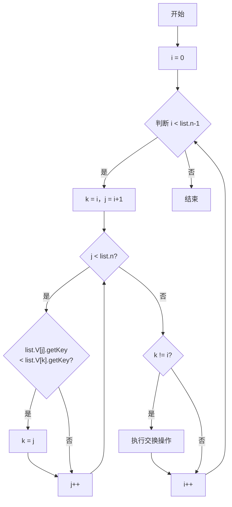


#### 控制流图

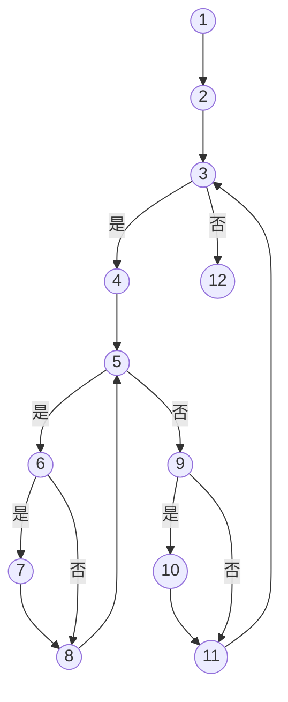

-  根据控制流图 边数`E=15` 结点数`N=12` 判断结点数 `P=4` ，`v(g)=E-N+2=5, v(g)=P+1=5`

#### 独立路径

| 编号 | 包含路径                                                                    |
|:--:|:------------------------------------------------------------------------|
|  1 |                                                    1-&gt;2-&gt;3-&gt;12 |
|  2 |                     1-&gt;2-&gt;3-&gt;4-&gt;5-&gt;9-&gt;11-&gt;3-&gt;12 |
|  3 |              1-&gt;2-&gt;3-&gt;4-&gt;5-&gt;9-&gt;10-&gt;11-&gt;3-&gt;12 |
|  4 |       1-&gt;2-&gt;3-&gt;4-&gt;5-&gt;6-&gt;8-&gt;5-&gt;9-&gt;11-&gt;3-12 |
|  5 | 1-&gt;2-&gt;3-&gt;4-&gt;5-&gt;6-&gt;7-&gt;8-&gt;5-&gt;9-&gt;11-&gt;3-12 |  

#### 设计测试用例

| datalist  | 预期结果      | 覆盖路径 |
|:----------|:----------|:-----|
| []        | []        |    1 |
| [1]       | [1]       |    2 |
| [2, 1]    | [1, 2]    |    3 |
| [1, 2]    | [1, 2]    |    4 |
| [2, 1, 3] | [1, 2, 3] |    5 |  

#### 测试测序

```go
package whitebox

import (
	"testing"
)

func TestSelectSort(t *testing.T) {
	testCases := []struct {
		list *datalist[int]
		expectedResult *datalist[int]
	}{
		{CreateDatalist([]int{}), CreateDatalist([]int{})},
		{CreateDatalist([]int{1}), CreateDatalist([]int{1})},
		{CreateDatalist([]int{2, 1}), CreateDatalist([]int{1, 2})},
		{CreateDatalist([]int{1, 2}), CreateDatalist([]int{1, 2})},
		{CreateDatalist([]int{2, 1, 3}), CreateDatalist([]int{1, 2, 3})},
	}

	for _, tc := range testCases {
		list := make([]Element[int], len(tc.list.V))
		copy(list, tc.list.V)
		SelectSort(tc.list)
		if !SliceEqualBCE(tc.list.V, tc.expectedResult.V, func(x, y Element[int]) bool {
			// key相等则视为这两个元素相等
			return x.key == y.key
		}) {
			t.Errorf("SelectSort(%v), 期望输出： %v, 实际输出：%v",
				list, tc.expectedResult.V, tc.list.V)
		}
	}
}

func SliceEqualBCE[T any](a , b []T, equal func(x, y T) bool) bool {
    if len(a) != len(b) {
        return false
    }

    if (a == nil) != (b == nil) {
        return false
    }

    b = b[:len(a)]
    for i, v := range a {
        if !equal(v, b[i]) {
            return false
        }
    }

    return true
}
```


## 实验结果

### 题目一


### 题目二


### 题目三


### 题目四


## 讨论分析

在进行逻辑覆盖测试方法的实验过程中，我们通过设计不同的测试用例来覆盖程序中的各个路径和条件，以验证程序的正确性。以下是对实验过程的讨论和分析：

1.  正确结果： 当测试用例能够覆盖到程序中的所有执行路径和条件组合时，我们可以得到正确的结果。这意味着程序在不同情况下都能按照预期执行，产生正确的输出。
    
2.  错误的原因： 错误的原因可能有多种情况，包括但不限于以下几点：
    
    a. 遗漏覆盖路径或条件组合：如果测试用例设计不完善，没有覆盖到某些路径或条件组合，那么程序在这些情况下的行为就没有得到验证，可能存在潜在的错误。
    
    b. 错误的边界测试：边界条件是测试用例设计中的重要考虑因素。如果边界测试不充分，即没有涵盖到所有边界情况，可能会导致对边界行为的错误判断，从而影响程序的正确性。
    
    c. 代码错误：如果程序本身存在逻辑错误或编码错误，那么无论测试用例设计得多么充分，都可能无法得到正确的结果。这种情况需要通过代码审查、调试等方法来解决。
    
3.  避免同类错误的方法： 为了避免类似的错误，可以采取以下措施：
    
    a. 设计充分的测试用例：根据不同的覆盖准则，设计能够覆盖到程序中所有可能路径和条件组合的测试用例。这可以通过理解程序的逻辑、边界条件和可能的异常情况来实现。
    
    b. 使用边界测试：针对程序的输入和条件，设计针对边界情况的测试用例。边界测试可以帮助我们验证程序在边界条件下的行为，从而发现潜在的错误。
    
    c. 代码质量保证：进行代码审查和测试之前，确保程序的逻辑正确性和编码质量。这可以通过严格的代码开发规范、单元测试和集成测试等方法来实现。
    
    d. 结合理论知识：在测试过程中，结合理论知识对程序的特性、约束和预期行为进行分析和验证。这有助于更全面地设计测试用例，并发现可能存在的问题。

在路径覆盖测试中，我们通过设计测试用例来执行每条可能的路径，以验证程序的正确性。以下是对路径覆盖法的讨论：

1.  基本路径： 基本路径是程序控制流图中的最小独立路径，它包含了程序中的所有语句至少一次的执行序列。基本路径是路径覆盖测试的基础，通过覆盖所有基本路径，可以确保覆盖到程序的所有语句。
    
2.  测试路径设计： 测试路径是指在路径覆盖测试中所设计的测试用例执行的路径序列。为了覆盖到程序中的所有可能路径，需要设计测试用例，使得每个基本路径至少执行一次。测试路径的设计需要考虑以下几个方面：
    
    a. 确定基本路径：首先，根据程序的控制流图，确定程序中的所有基本路径。基本路径可以通过分析控制流图和代码结构来获得。
    
    b. 设计测试用例：根据基本路径，设计测试用例来执行每个基本路径。测试用例应包含适当的输入数据，以覆盖程序中的条件和分支。
    
    c. 执行路径：通过执行测试用例，按照设计的测试路径执行程序。确保每个基本路径都被至少一个测试用例所覆盖。
    
3.  路径覆盖的优点和局限性： 路径覆盖法的优点是能够覆盖到程序中的所有可能路径，对程序的覆盖率较高，能够发现潜在的错误和逻辑问题。通过执行所有可能路径，可以增加对程序行为的全面了解。
    

然而，路径覆盖法也存在一些局限性：

a. 路径爆炸：程序中的路径可能非常多，特别是对于复杂的程序，路径的数量可能会呈指数级增长，导致测试用例的设计和执行变得非常困难。

b. 不可达路径：在某些情况下，由于程序的约束条件或逻辑限制，可能存在一些不可达的路径，这些路径无法通过常规的测试用例来覆盖。

c. 资源消耗：路径覆盖要求执行所有可能的路径，可能需要大量的时间和资源来完成测试，特别是对于复杂的程序。

4.  结合其他方法： 为了克服路径覆盖法的局限性，通常可以结合其他测试方法来进行测试，例如基于等效类划分的测试、边界值分析、随机测试等。结合多种测试方法可以提高测试的效率和效果，找到更多潜在问题。